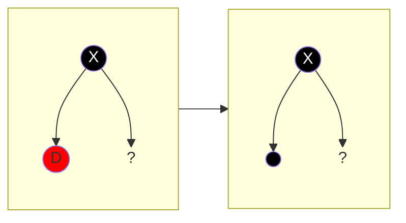
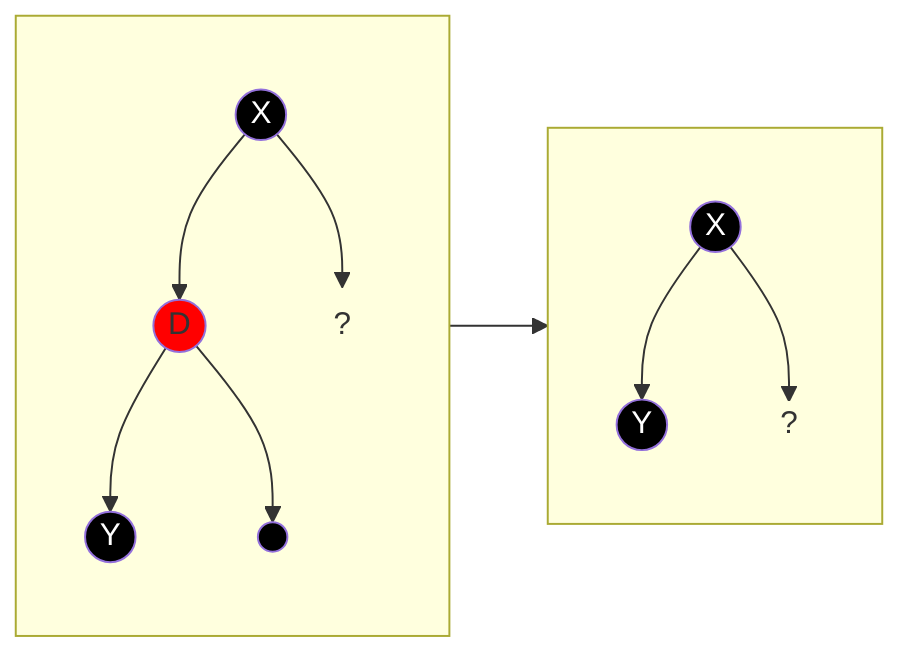
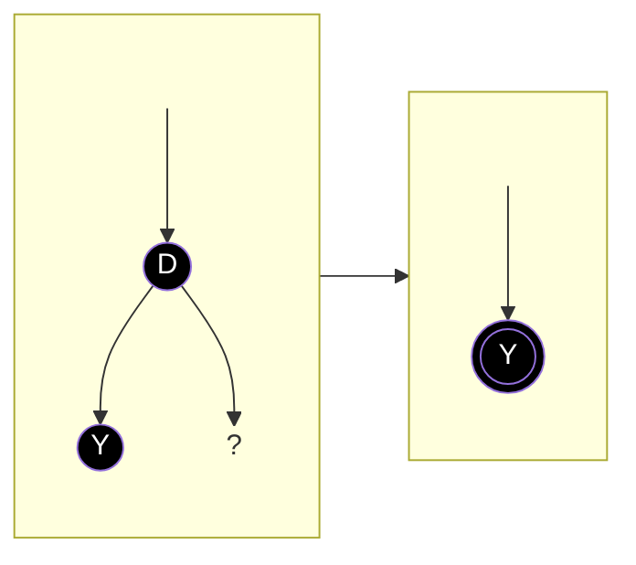
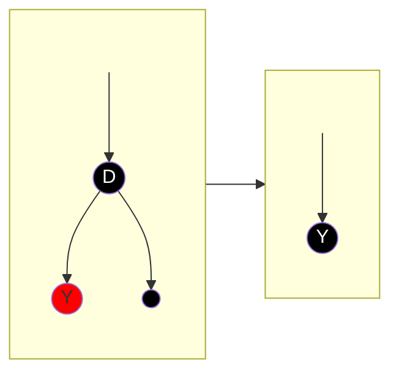
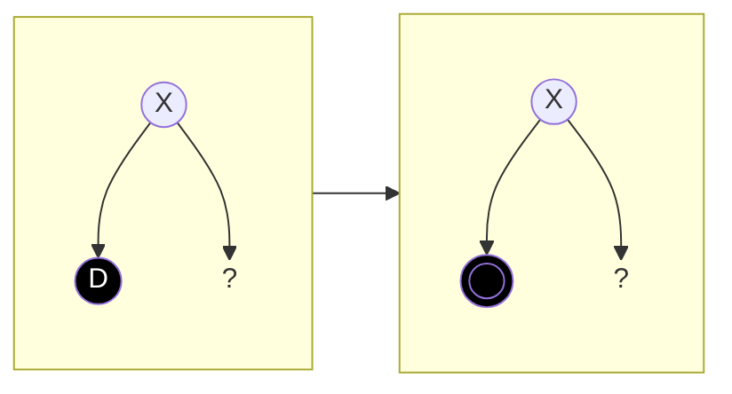
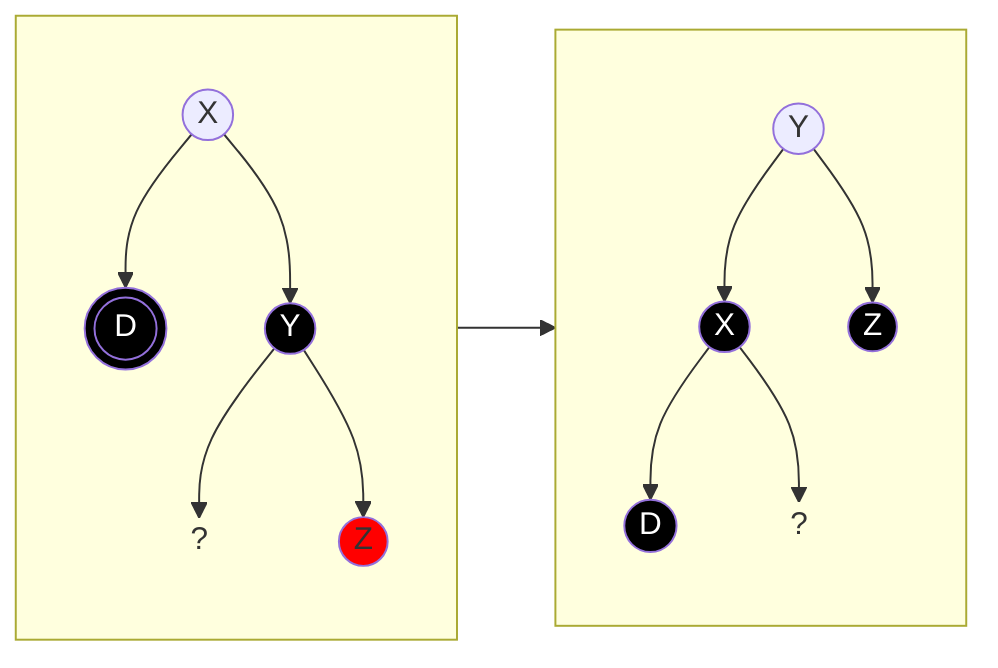
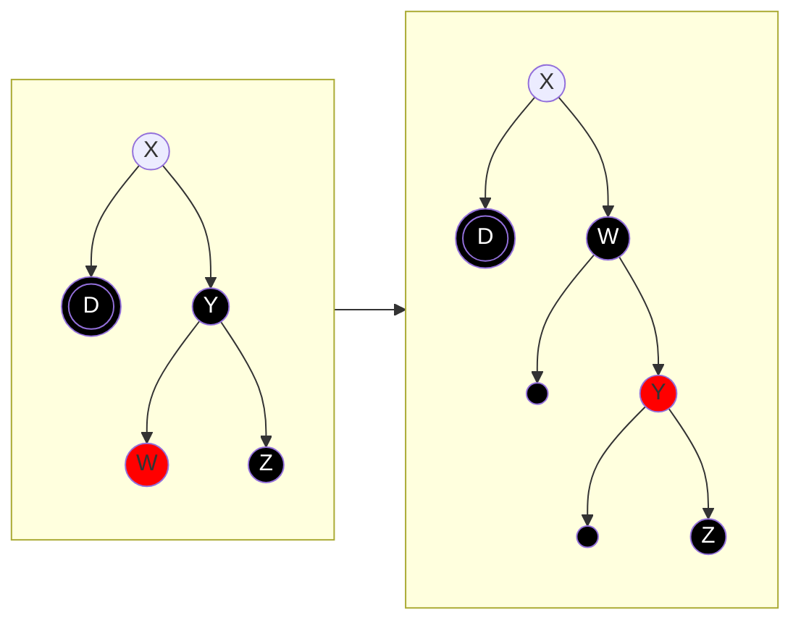
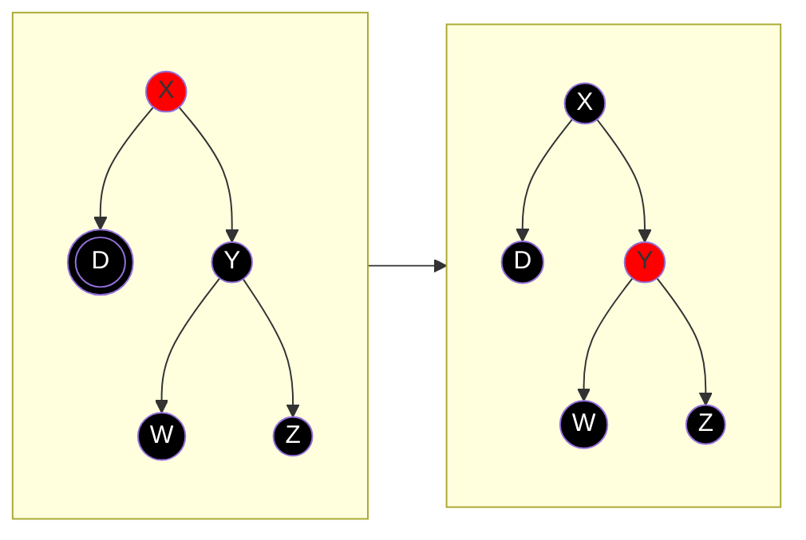
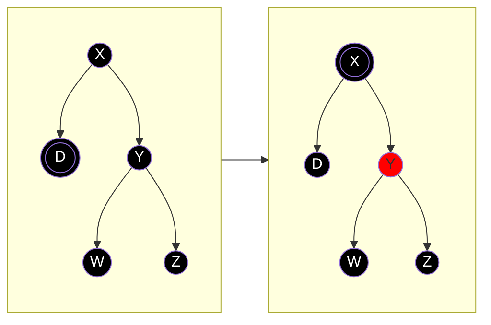
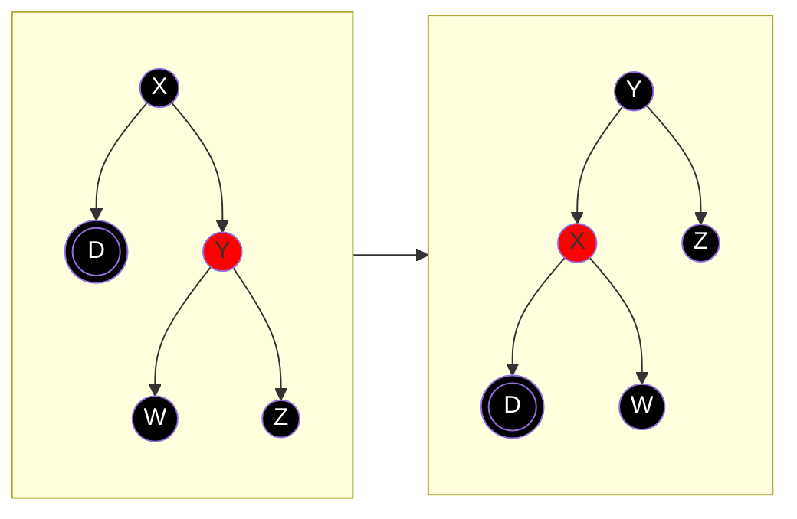

#university #in-class #subject-2101
### 2023-11-02
> [!summary] Algoritmi

## BST
### Cancellazione di un nodo
**Caso 1: 0 figli**
Il nodo da cancellare è una foglia. È sufficiente rimuovere l'arco e il nodo in questione.
**Caso 2: 1 figlio**
Il nodo da cancellare ha un solo figlio. È sufficiente collegare il padre con l'unico figlio.
**Caso 3: 2 figli**
Il nodo da cancellare ha due figli. Si procede scambiando il nodo con il suo successore ed eliminando il nodo del vecchio (ormai scambiato) nodo successore.

## Red-Black Trees
Assumiamo sempre che la rotazione implichi lo scambio dei colori tra il nodo da ruotare e il padre.
### Cancellazione di un nodo
#### Nodo rosso
*Nel caso in cui un nodo abbia due figli, si procede come nel caso del BST, valutando quindi il nodo successore*
###### Caso 1: nodo rosso con 0 figli
È sufficiente rimuovere il nodo.

###### Caso 2: nodo rosso con 1 figlio
Il padre e il figlio sono due nodi neri.
È sufficiente rimuovere il nodo e collegare il padre al figlio del nodo.

#### Nodo nero
###### Caso 1: nodo nero con 1 figlio nero
Si passa il nero al figlio. Il figlio è già nero quindi diventa momentaneamente un "doppio nero".

###### Caso 2: nodo nero con 1 figlio rosso
Si passa il nero al figlio e si elimina il nodo.

###### Caso 3: nodo nero con 0 figli
Il nodo viene eliminato e il padre fatto puntare a `null`. Il nodo eliminato passa il nero al `null`.
Il `null` del padre diventa momentaneamente un "doppio nero".

#### Fixup per eliminare i doppi neri
##### Caso 1: il fratello è nero con almeno un figlio rosso
###### Caso 1.1: il fratello è nero con figlio destro (esterno) rosso
Si effettua una rotazione sinistra sul fratello (ricordando di effettuare lo scambio di colore).
Il nodo doppio nero trasferisce il suo "doppio nero" al figlio destro del fratello (facendo riferimento alla configurazione pre-rotazione).

###### Caso 1.2: il fratello è nero e ha il figlio destro (esterno) nero e il figlio sinistro (interno) rosso
Si effettua una rotazione destra sul figlio sinistro del fratello. Ci ritroviamo nel caso [[2023-11-02 - RBT (delete)#Caso 1.1 il fratello è nero con figlio destro (esterno) rosso|1.1]].

##### Caso 2: il fratello è nero con entrambi i figli neri
###### Caso 2.1: il padre è rosso
Il nodo doppio nero e il fratello trasferiscono il nero al padre.
Ovviamente il nodo doppio nero diventa nero dopo il trasferimento del colore, e il fratello rosso.

###### Caso 2.2: il padre è nero
Si procede come nel caso precedente, soltanto che a questo punto il padre diventa doppio nero.
Quindi si richiama ricorsivamente la procedura sul padre.
*Se il nodo dovesse giungere alla radice, il doppio nero può essere direttamente eliminato*

##### Caso 3: il fratello è rosso
Di conseguenza il fratello ha il padre e i figli neri.
Si effettua una rotazione sinistra sul fratello.
A questo punto il nodo doppio nero ha il fratello nero. Siamo quindi nel caso 1 o nel caso 2: si procede ricorsivamente.

