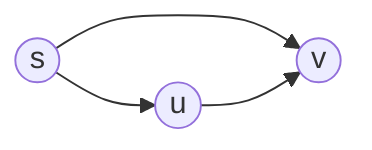
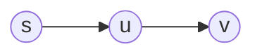

#university #in-class #subject-2101
### 2023-12-12
> [!summary] Algoritmi

# Label Correcting
## Proprietà del Label Correcting
### Disuguaglianza triangolare


$$\delta(s, v) \leq \delta(s,u)+w(u,v)$$
### Limite Superiore
$$ d[v] \geq \delta(s, v)$$

### Assenza del cammino
Se non esiste un cammino $\delta(s, v) = d[v] = +\infty$.
### Convergenza del cammino

Sia $d[u] = \delta(s, u)$.
Se si effettua una `RELAX(u, v, w)` su $v$ passando da $u$ allora $d[v] = \delta(s, v)$.
### Rilassamento del cammino
Sia $p = < s, u_{0}, u_{1}, \dots, u_{k}, v >$ un cammino minimo.
Usando la [[2023-12-12 - label correcting#Convergenza del cammino|proprietà della convergenza]] si possono rilassare in sequenza i nodi $(s, u_{0}), (u_{0}, u_{1}), \dots, (u_{k}, v)$, ottenendo $d[v]=\delta(s, v)$.
## Algoritmi
Per grafi con cicli con peso complessivo negativo il problema non ha soluzione e non è quindi risolvibile.
- Algoritmo di Bellman-Ford
	- Individua se il problema è risolvibile (ovvero se esistono cicli con peso negativo)
	- Risolve il problema su grafi senza limitazioni (ovvero riesce a gestire cicli e archi con peso negativo)
- Algoritmo di Dag-SP (Directed Acyclic Graph Shortest Path)
	- Risolve il problema in tempo lineare su grafi direzionali aciclici, anche con archi di peso negativo.
- Algoritmo di Dijkstra (si legge *daikstra*)
	- Risolve il problema su grafi con archi di peso positivo.

### Algoritmo di Dag Shortest Path
Effettua l'ordinamento topologico e sulla base di quello vengono effettuati i rilassamenti.
Si iterano tutti i nodi seguendo l'ordinamento topologico e per ogni nodo vengono rilassati tutti gli archi che partono dal nodo in questione.
```
DAG-SHORTEST-PATH (G, w, s)
	V = TOPOLOGICAL_SORT(G)
	FOR v in V:
		FOR u in Adj(v):
			RELAX(v, u, w)
```
La complessità è lineare $O(|V| + |E|)$.
### Algoritmo di Bellman Ford
Nel peggiore dei casi, il cammino minimo comprende tutti i nodi del grafico.
Bastano $|V|-1$ iterazioni di relax di tutti gli archi per poter ottenere tutti i cammini minimi. $N\leq|V|-1$
```
BELLMAN-FORD (G, w, s):
	FOR v IN G.V:
		d[v] = +INF
		PI[v] = NULL
	d[s] = 0
	FOR 1 TO |G.V|-1:
		FOR (u, v) IN G.E:
			RELAX(u, v, w)
	// si individuano eventuali cicli a peso negativo
	FOR (u, v) IN G.E:
		// esistono archi ancora rilassabili, è solo possibile in grafi con cicli con peso negativo
		IF d[v] > d[u] + w(u, v):
			RETURN FALSE;
	RETURN TRUE;
```
La complessità è quadratica $O(|V| \cdot |E|)$.

