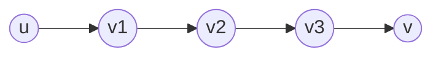

#university #in-class #subject-2101
### 2023-12-21
> [!summary] Algoritmi

# APSP
**All Pairs Shortest Path**
Indica il problema del calcolo del cammino minimo tra tutte le coppie di nodi.

$$\forall\, u, v \in V \text{ dobbiamo calcolare } \delta(u, v)$$

In SSSP utilizzavamo $d[v]$ per contenere il cammino minimo attuale dal nodo $s$ al nodo $v$. Qui è necessario cambiare la sorgente, quindi si utilizza una matrice $D$.
$D[i, j]$ indica il cammino minimo attuale da $i$ a $j$.
*Invece di $u$ e $v$ si utilizzano, per convenzione, $i$ e $j$.*

L'obiettivo è ottenere $D[i, j] = \delta(i, j) \quad \forall\, i, j \in V$.

Per questo tipo di problemi conviene sempre utilizzare la matrice di adiacenza per rappresentare il grafo. Il vantaggio di efficienza delle liste viene perso dovendo utilizzare $D$.

> [!info] Rappresentazione di un grafo direzionale tramite matrice
> Si ricorda che per rappresentare un grafo non pesato direzionale, si utilizza una matrice dove in ogni cella è presente $1$ se è presente un arco che va da $i$ a $j$ (rispettivamente da numero di riga $i$ verso numero di colonna $j$), altrimenti $0$.
> 
> Per i grafi pesati al posto di $1$ si mette il peso dell'arco, e al posto di $0$ si mette $+\infty$ (come se l'arco esistesse ma con un peso infinito). Nella diagonale principale sarà presente il peso dell'arco che va da un nodo verso se stesso. Sarà quindi presente $0$ in tutte le celle della diagonale principale ($i=j$)

La matrice $D$ conterrà $0$ in tutte le celle della diagonale principale. Ogni nodo per raggiungere se stesso ha un $\delta=0$. Quindi $\delta(i,i)=0 \quad \forall\, i \in V$
> Nota: Se il grafo dovesse contenere cicli con peso negativo quanto descritto precedentemente non varrebbe più, e il problema non sarebbe risolvibile.

### Algoritmo con SSSP
Avendo già visto come risolvere il problema di SSSP. sarebbe sufficiente effettuare $|V|$ iterazioni di algoritmi SSSP e si risolverebbe il problema.
La complessità sarebbe quindi quella dell'algoritmo SSSP utilizzato, moltiplicata per $|V|$. Quindi:
- `BF`: $O(|V|^{4})$
- `DAG`: $O(|V|^{3})$
- `DIJ`: $O(|V|^{3} \cdot \log |V|)$

Non è il modo più efficiente di risolvere il problema.
> Il problema di SSSP gode della proprietà della sottostruttura ottima e quindi utilizzando sotto problemi ottimali arriva a risolvere il problema principale. Vengono quindi calcolati tutti i sottocammini minimi da ogni nodo del cammino minimo principale verso il nodo finale.
> 
> Ad esempio, calcolare $\delta(u, v)$ con SSSP, consente anche di trovare $\delta(v_{1}, v)$, $\delta(v_{2}, v)$ e $\delta(v_{3}, v)$.


**Si sfrutta la programmazione dinamica.**

Indichiamo con $m$ la lunghezza massima di un cammino minimo.
Indichiamo con $\delta^{m}(i, j)$ il cammino minimo da $i$ a $j$ di lunghezza al massimo $m$.
In tutti i grafi vale
$$\delta(i, j) = \delta^{|V|-1}(i, j) \quad \forall\, i,j \in V$$
in quanto in un cammino minimo non può essere più lungo di $|V|-1$ archi (stesso ragionamento utilizzato in [[2023-12-12 - label correcting#Algoritmo di Bellman Ford|Bellman Ford]]). Se si ottiene un cammino minimo inferiore anche un numero di archi superiore, vuol dire che sono presenti cicli con peso negativo.

$$D^{1}=w\to D^{2}\to \dots \to D^{V-1}$$
dove $w$ è la matrice che rappresenta i pesi del grafo (e quindi il grafo vero e proprio).

**Caso Base**:
- si potrebbe prendere $m=0$. In questo caso $D[i,j]=0 \iff i=j$, altrimenti $d[i,j]=+\infty$.
- si prende invece $m=1$ considerando che coincide con la matrice del grafo iniziale.
**Passo Induttivo**: si ottiene $D^{m}$ a partire da $D^{m-1}$. Quindi $D^{m-1} \to D^m$.

Per passare da $\delta^{m-1}(i,j)$ a $\delta^{m}(i,j)$ è sufficiente aggiungere un arco. Il ragionamento è analogo a quello fatto per la `RELAX`:
$$
\begin{align}
D^{m}[i,j] &=\min\left(D^{m-1}[i,j], \min\limits_{0 \leq k < n}(D^{m-1}[i,k] + w[k,j])\right) \tag{D.1}\\&=\min\limits_{0 \leq k < n}(D^{m-1}[i,k] + w[k,j]) \tag{D.2}
\end{align}
$$
Nel calcolo del minimo più interno della formula ${} (\text{D.1}) {}$, si può evitare di controllare il caso in cui $k=i \lor k=j$. Coinciderebbe con il dover calcolare $D^{m-1}[i,j]$ (che è calcolato esternamente).

```
n = |V|

EXTEND-SHORTEST-PATH(Dn_1, w):
	Dn = MATRIX(n x n)
	FOR i=1 TO n DO:
		FOR j=1 TO n DO:
			Dn[i,j] = +INF
			FOR k=1 TO n DO:
				Dn[i,j] = min(Dn[i,j], Dn_1[i,k]+w(k, j))
	RETURN Dn;

APSP(w):
	D1 = w
	FOR m=2 TO n-1:
		Dm = EXTEND-SHORTEST-PATH(Dm_1, w)
	// si potrebbe controllare che non siano presenti cicli con peso negativo come fatto con BF.
	RETURN D
```
La complessità è $O(|V|^{4})$, uguale a quella ottenuta dall'iterazione dell'algoritmo di BF.

L'algoritmo sopra citato viene chiamato anche come metodo della moltiplicazione di matrici.
```
MATRIX-MULTIPLY(A, B):
	C = MATRIX(n x n)
	FOR i=1 TO n DO:
		FOR j=1 TO n DO:
			C[i,j]=0
			FOR k=1 TO n DO:
				C[i, j] += A[i,k] + B[k, j]
```
Questo algoritmo che effettua la moltiplicazione tra due matrici è molto simile a quello di `EXTEND-SHORTEST-PATH`.
$$D^{m-1} \times w \to D^{m}$$
Con l'algoritmo calcoleremo $D$ come segue:
$$
\begin{align}
D^{1}&=w \\ D^{2}&=D^{1} \times w \\ D^{3}&=D^{2} \times w \\ \dots
\end{align}
$$
Di fatto è come scrivere $D^{m-1} \times D^1 \to D^{m}$. Vale quindi la proprietà della somma degli esponenti (come avviene per il prodotto di potenze).
Per calcolare $D^{n}$ è sufficiente calcolare $D^\frac{n}{2}$ e moltiplicare la matrice per se stessa. $D^{\frac{n}{2}} \times D^{\frac{n}{2}} \to D^{n}$.
L'algoritmo a questo punto diventa logaritmico $O(|V|^{3} \cdot \log |V|)$.
```
FAST-APSP(w)
	D1 = w
	m = 1
	WHILE (m < n-1) DO
		D^2m = EXTEND-SHORTEST-PATH(D^m, D^m)
		m = 2m
	RETURN D^m
```
Se $|V|=11$ per calcolare $D^{11}$ arriverei (moltiplicando per due) a $D^{16}$ ($D^{1} \to D^{2} \to D^{4} \to D^{8} \to D^{16}$).
Se non esistono cicli di peso negativo, $D^{11} = D^{16}$.

> [!question] Possibile domanda
> Scrivere la definizione ricorsiva del calcolo di una soluzione ottima dell'algoritmo `FAST-APSP`.
> $D^{m} \times D^{m} = D^{2m}$.
