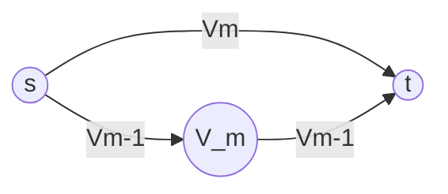

#university #in-class #subject-2101
### 2024-01-11
> [!summary] Algoritmi

## APSP
### Algoritmo di Floyd-Warshall
A differenza del metodo della moltiplicazione delle matrici, la dimensione non è più data dalla lunghezza del cammino, bensì dai **nodi intermedi che possono essere coinvolti in un cammino minimo**.
Per nodo intermedio si intende, dato un cammino, l'insieme dei nodi che non comprendono nodo iniziale e nodo finale.
Tale numero lo chiamiamo $n$.

Sia $V$ l'insieme dei nodi del grafo.
Indicheremo con ${} V_{m} {}$ il sottoinsieme di $V$ che contiene i primi $m$ nodi di $V$. Vale quindi $V_{m} \subseteq V \land |V_{m}|=m$ 
${} V_{m}$ è definito per valori di $m$ da $0$ (insieme vuoto) a $n$ (quindi $V_{n}=V$).

Siano $s$ e $t$ rispettivamente i nodi di inizio e fine del cammino.
Valutando $V_{0}$, deve esistere un cammino diretto che collega $s$ e $t$.
Valutando $V_{1}$, deve esistere un cammino diretto che collega $s$ e $t$, oppure un nodo intermedio (il primo) che collega $s$ e $t$.
Valutando ${} V_{2} {}$, deve esistere un cammino diretto che collega $s$ e $t$, oppure due nodi intermedi (i primi due) che collegano $s$ e $t$.
...

**Caso Base**: $V_{0}$.

**Passo Induttivo**
Si ottiene $V_{m}$ a partire da  $V_{m-1}$.

$$
D^{m}[i,j]= \min(D^{m-1}[i,j], D^{m-1}[i,m]+D^{m-1}[m,j])
$$

Sia $w=D^{0}$ ($D$ ha la stessa definizione della lezione precedente).
```
FLOYD-WARSHALL(w, n):
	D0 = w
	FOR m=1 TO n DO:
		Dm = new matrix[n x n]
		FOR i=1 TO n DO:
			FOR j=1 TO n DO:
				Dm[i, j] = Dm_1[i, j]
				IF Dm_1[i, m] + Dm_1[m, j] < Dm[i, j]
					Dm[i, j] = Dm_1[i, m] + Dm_1[m, j]
```
La complessità è $O(|V|^{3})$.

In Bellman-Ford era possibile individuare eventuali cicli con peso negativo e restituire errore. Era sufficiente aggiungere un'ulteriore iterazione nel codice.
In Floyd-Warshall questo non è possibile. Bisogna assicurarsi che il grafo passato in input non contenga cicli con peso negativo.

L'implementazione precedente non salva in `PI` la cronologia dei nodi percorsi. Bisogna quindi modificare l'algoritmo.
$$
\pi^{0}[i, j] = \begin{cases}
i &\text{se } i \neq j \,\lor\, (i, j) \in E \\
\text{null} &\text{se } i = j \,\land\, (i, j) \not\in E
\end{cases}
$$

```
FLOYD-WARSHALL(w, n):
	D0 = w
	FOR m=1 TO n DO:
		PIm = new matrix[n x n]
		Dm = new matrix[n x n]
		FOR i=1 TO n DO:
			FOR j=1 TO n DO:
				Dm[i, j] = Dm_1[i, j]
				PIm[i, j] = PIm_1[i, j]
				IF Dm_1[i, m] + Dm_1[m, j] < Dm[i, j]
					Dm[i, j] = Dm_1[i, m] + Dm_1[m, j]
					PIm[i, j] = PIm_1[m, j]
```

La seguente implementazione prevede l'utilizzo di un'unica matrice per `D` e `PI:
```
FLOYD-WARSHALL(w, n):
	D = w, PI = { ... (sistema di sopra)
	FOR m=1 TO n DO:
		FOR i=1 TO n DO:
			FOR j=1 TO n DO:
				IF D[i, m] + D[m, j] < D[i, j]
					D[i, j] = D[i, m] + D[m, j]
					PI[i, j]=PI[m, j]
```

*vedi esempio nel libro*


*facendo gli esercizi "a mano", se $D[i,m]$ o $D[m, j]$ contiene più infinito, l'intera riga o colonna può essere ricopiata direttamente*
