# Appunti di Algoritmi (Teoria)
Made by [Matteo Galletta](https://github.com/MatteoGalletta/university), A.A. 2023/2024

---
## Algoritmi di ordinamento

Un problema di ottimizzazione è un problema che ammette più soluzioni
Esempio:
- Trovare il percorso più corto tra due nodi di un grafo
Esempio di problema **NON** di ottimizzazione:
- Ordinare un array (l'array finale ordinato è unico)

Algoritmo adattivo: se si avvantaggia (tiene conto del tipo) dell'input per ottimizzare la complessità.

Algoritmi di ordinamento
- Bubblesort
- Insertionsort
- Selectionsort
- Mergesort
- Quicksort

Complessità algoritmi di ordinamento
- Caso Pessimo
- Caso Migliore
- In loco
- Stabilità
## Heap

**Heap (Priority Queue)**:
- `Insert(k)` con `k` priorità
- `Max()`
- `Extract-Max()`
- `Delete(x)` con `x` elemento
- `Increase-Key(x, k)` con `x` elemento e `k` priorità

*la stessa struttura esiste anche al contrario (dove i valori più piccoli hanno priorità)*

Tutti i metodi hanno complessità $O(\log n)$, tranne `Max()` che ha complessità $O(1)$.

A differenza dell'albero binario classico, l'heap è un albero binario (quasi) completo: tutti i livelli sono completi (ovvero sono presenti tutti i nodi) ad eccezione dell'ultimo che può non contenere degli elementi. Se però mancano degli elementi, allora quelli presenti sono allineati a sinistra.

Nel Max-Heap, ogni nodo ha la priorità più alta dei nodi figli.

In un albero completo, il numero di foglie è $\geq$ del numero di nodi interni. Il numero di foglie di un albero completo è uguale a $2^h-1$ dove $h$ è l'altezza dell'albero.

`Heapify(x)`: crea un heap a partire dal nodo `x`. È utile quando non si è sicuri che l'heap a partire da `x` sia valido, nonostante i due figli lo siano (se non lo sono, l'algoritmo non funziona).
Si scambiano le chiavi del nodo `x` con quella del nodo figlio con chiave maggiore. Si richiama l'`heapify` ricorsivamente sul nodo figlio.

```cpp
// O(log n)
void heapify(Node* x) {
	Node* left = node->left;
	Node* right = node->right;
	Node* max = x;
	if (left != nullptr && left->key > max->key)
		max = left;
	if (right != nullptr && right->key > max->key)
		max = right;
	if (max != x) {
		swap(x->key, max->key):
		heapify(max);
	}
}
```

Nell'heap è presente un puntatore detto `HeapSize` che punta al nodo più a destra dell'ultimo livello

```cpp
void extractMax() {
	swap(root->key, heapSize->key);
	removeHeapSize(); // viene staccato il nodo puntato dall'heapSize dall'albero e viene aggiornato l'heapSize.
	heapify(root);
}
```
*L'`HeapSize` viene approfondito nelle sezioni successive*

```cpp
void increaseKey(Node* x, Priority k) {
	x->key = k;
	while (x != root && x->parent->key < x->key) {
		swap(x->key, x->parent->key);
		x = x->parent;
	}
}
```

```cpp
void insert(Priority k) {
	// aggiunge un nodo in corrispondenza dell'heapsize, incrementandolo
	Node* x = createNodeAtHeapSize(-INFINITY); // pseudocodice -infinito
	increaseKey(x, k);
}
```

```cpp
void delete(Node *x) {
	swap(x->key, heapSize->key);
	removeHeapSize();
	heapify(x);
}
```
In realtà l'heap non viene implementato mediante un albero, bensì utilizzando un array.


L'heap viene rappresentato da un array.

Il nodo root sarà il primo elemento dell'array, le due foglie del nodo root saranno il secondo e il terzo elemento, e così via (a livelli).

Come accedere agli elementi dell'heap rappresentato da un array?

Il figlio sinistro di un nodo si calcola con $2 \times i$, dove $i$ è l'indice dell'elemento del nodo attuale. Per il figlio destro è sufficiente sommare uno, ottenendo: $2 \times i + 1$. Gli indici partono da 1.

```cpp
int left(int* A, int i)  { return A[i * 2]; } // oppure A[i << 1];
int right(int* A, int i) { return A[i * 2 + 1]; } // oppure A[(i << 1) + 1];
```

Per accedere al padre basta dividere per due (e ignorare la parte decimale).
```cpp
int parent(int* A, int i) { return A[i/2]; } // oppure A[i >> 1];
```

L'heapsize non è quindi un puntatore ma un indice che punta all'ultimo elemento dell'array. Coincide con il numero di elementi presenti nell'array.
Il length invece è il numero di celle dell'array allocate (e non necessariamente utilizzate).

Le operazioni diventano:
```cpp
// si assume che l'indice dell'array parta da 1 
class Heap {
	int *A, n, heapify;
	
	// ...

	int left(int i)   { return i * 2; }
	int right(int i)  { return i * 2 + 1; }
	int parent(int i) { return i / 2; }

	int max() {
		return A[1];
	}
	
	int heapify(int i) {
		int l = left(i);
		int r = right(i);
		int m = i;
		if (l <= heapsize && A[m] < A[l])
			m = l;
		if (r <= heapsize && A[m] < A[r])
			m = r;
		if (m != i) {
			swap(A[i], A[m]);
			heapify(m);
		}
	}

	int extract_max() {
		swap(A[1], A[heapsize--]);
		heapify(1);
	}

	void increase_key(int i, int k) {
		A[i] = k;
		int p;
		p = parent(i);
		while (i > 1 && A[p] < A[i]) {
			swap(A[i], A[p]);
			i = p;
			p = parent(i);
		}
	}

	void insert(int k) {
		increase_key(++heapsize, k);
	}
}
```

Esempio di domanda:
> Supponiamo di avere un heap vuoto e di inserire un elemento alla volta della seguente sequenza di elementi: `[2, 7, 9, 1, 2, 4, 6, 11, 8]`. Rappresentare l'heap (l'array) ad ogni passo d'inserimento.


Se si ha un array che rappresenta un albero che non rispecchia però le condizioni di ordinamento parziale (ci sono dei nodi più piccoli dei figli) dell'heap, si può utilizzare la seguente funzione:
```cpp
void buildMaxHeap(int* A, int n) {
	for (int i = n/2; i >= 0; i--)
		heapify(A, i);
}
```
La complessità è $O(n)$.

### Heapsort

1. Si richiama il buildMaxHeap sull'array da ordinare $O(n)$
2. Si fa l'extractMax sul nuovo array finché non si svuota $O(n \cdot \log n)$

```cpp
void heapSort(int *A, int n) {
	buildMaxHeap(A, n);
	for (int i = 1; i < n; i++) // n-1 iterazioni
		extractMax(A);
}
```

È comparabile al MergeSort come efficienza, ma lavora in loco.
A differenza dell'InsertionSort e MergeSort, l'heapsort non è adattivo (impiega sempre la stessa quantità di tempo anche sell'array è ordinato).

> [!question] È stabile?
> No. Controesempio:
> ```
2A 1B 2B 1A |
2B 1B 1A | 2A
1A 1B | 2B 2A
1B | 1A 2B 2A
| 1B 1A 2B 2A
> ```

## CountingSort

> [!hint] Algoritmi basati sui confronti
> Il TimSort è l'algoritmo di ordinamento più veloce al momento (non lo trattiamo) basato sui confronti.
> I problemi di ordinamento che utilizzano il confronto non possono fare meglio di $\Omega(n \log n)$.

Non si basa sui confronti.
Complessità: $O(n+k-h)$, con $k$ l'elemento massimo e $h$ l'elemento minimo.

`A=[4,6,2,4,4,3,2,3,7]`
`C=[2,2,3,0,1,1]`

```cpp
void countingSort(int* A, int n) {
	int k, h; // k: massimo - h: minimo
	max_min(A, n, &k, &h); // prende il massimo e il minimo dell'array
	int* C = new int[k-h+1]; // C conterrà già 0 in tutte le celle
	for (int i = 0; i < n; i++) {
		int idx = A[i]-h;
		C[idx]++;
	}

	int c = 0;
	for (int i = 0; i < k-h+1; i++) // scorro gli elementi di C
		for (int j = 0; j < C[i]; j++) {
			A[c] = i+h;
			c++;
		}

}
```

> [!warning] Nota
> L'implementazione precedente non funziona con dati satellite. L'algoritmo non è stabile.

---

Per risolvere il problema, si effettua un'ulteriore iterazione per aggiornare `C`.
`A=[4,6,2,4,4,3,2,3,7]`
`C=[2,2,3,0,1,1] -> [2,4,7,7,8,9]`

`C=[0,2,4,7,7,8]` (a fine algoritmo)
`B=[2,2,3,3,4,4,4,6,7]` (a fine algoritmo)

Adesso `C[i]` indica il numero di elementi minori o uguali a `i` in `A`.

Si può quindi scorrere `A` per trovare in `C` l'indice in cui posizionare l'elemento.
La nuova implementazione non consente più di modificare direttamente l'array `A`. È necessario un array ausiliario (che chiamiamo `B`).

```cpp
int* countingSort(int* A, int n) {
	int k, h; // k: massimo - h: minimo
	max_min(A, n, &k, &h); // prende il massimo e il minimo dell'array
	int* C = new int[k-h+1]; // C conterrà già 0 in tutte le celle
	for (int i = 0; i < n; i++) {
		int idx = A[i]-h;
		C[idx]++;
	}

	for (int i = 1; i < k-h+1; i++)
		C[i] += C[i-1];
		
	int* B = new int[n];
	for (int i = n - 1; i >= 0; i--) { // scorro A
		int idx = A[i]-h; // mi chiedo: dove cerco in C la corrispondenza?
		C[idx]--;
		int pos = C[idx]; // C[idx] contiene la posizione in cui inserire A[i]
		B[pos] = A[i];
	}
	
	return B;
}
```

> [!done] Nota
> Adesso l'algoritmo funziona con dati satellite ed è stabile (in quanto scorriamo da destra verso sinistra).
2A 1B 2B 1A

## RadixSort

Per ordinare un array sulla base di più chiavi è sufficiente ordinare per ogni chiave dalla meno importante alla più importante. È necessario che gli algoritmi di ordinamento utilizzati siano stabili, altrimenti il metodo non funziona.
*L'ordinamento, anche se non è stabile, se utilizzato solo sulla prima iterazione, rende comunque l'algoritmo funzionante, ma non stabile.*

Per ordinare numeri grossi con il counting sort si può utilizzare il metodo precedente, ordinando per ogni cifra separatamente.
Si può utilizzare `n%10` per ottenere l'ultima cifra e utilizzare $\frac{n}{10^{i-1}}\mod10$ per ottenere l'`i`-esima cifra da destra.
Questo algoritmo è detto **Radix Sort**.
```cpp
/*
se A=[8532, 2553, 2634] e i=2 il counting sort vede [5, 5, 6]
*/
void radixSort(int* A, int n) {
	int c = getMaxNumberOfDigits(A, n); // se max(A)=1'000'000   =>   c=7
	for (int i = 0; i < c; i++) {
		countingSort(A, n, i); // dove i è la posizione (da destra) della cifra su cui ordinare
	}
}
```

## Tabelle Hash
È importante avere una ricerca veloce, a costo di sacrificare tempi di inserimento e cancellazione.

#### Tabella a indirizzamento diretto
Si utilizza una tabella a indici da $0$ a $n$ dove il numero $a$ (compreso tra $0$ e $n$) si inserisce nella posizione $a$.
```cpp
void insert(int* A, int x) {
	A[x] = x;
}
void remove(int* A, int x) {
	A[x] = NULL; // pseudocodice
}
bool search(int* A, int x) {
	return A[x] != NULL;
}
```
Si può ottimizzare sostituendo il tipo dell'array da `int` in `bool` (mettendo `1` se l'elemento è presente, altrimenti `0`).
> [!warning] Nota
> Questa implementazione non funziona quando bisogna conservare numeri molto grandi (servirebbe un array di uguale dimensione).

Si consideri $U$ l'insieme delle chiavi da rappresentare.
Si utilizza una tabella (chiamata $T$) a indici da $0$ a $m-1$.
La tabella contiene meno celle delle chiavi da rappresentare: $|T|=m<|U|$

Si utilizza un *oracolo*: è una funzione, detta **funzione hash**, che prende in input un elemento di $U$ e restituisce un numero compreso tra $0$ e $m-1$.
$$ h: U \to \{0, 1, \dots,m-1\}$$

È importante che la funzione hash ritorni sempre lo stesso valore per lo stesso numero dato in input.

Essendo $|T|<|U|$ esistono delle collisioni: $\exists\, k_{1},k_{2} \in U:\,h(k_{1})=h(k_{2})$.
Esistono molti metodi per risolvere il problema e conservare $k_{1}$ e $k_{2}$.
##### Metodo concatenazione
Si utilizzano le liste.
Ogni elemento di $T$ è in realtà una lista a cui vanno concatenati gli elementi man mano che vengono inseriti.
Con questo metodo bisogna effettuare la ricerca all'interno di una lista in tempo lineare (e non più costante).
Consideriamo $\alpha = \frac{n}{m}$ chiamato **fattore di carico**, dove $n$ è il numero di elementi.
Ogni operazione di ricerca impiega in media $O(\alpha)$, adattando $m$ si può considerare un tempo costante.
```cpp
void insert(list* T, int k) {
	T[h(k)].insert(k);
}
void remove(list* T, int k) {
	T[h(k)].remove(k);
}
bool search(list* T, int k) {
	return T[h(k)].search(k);
}
```
#### Metodo indirizzamento aperto
A differenza del metodo d'indirizzamento diretto, qui gli elementi vengono conservati direttamente all'interno della tabella hash (e non in delle liste di cui si conserva solo l'indirizzo).
Ricordando $\alpha=\frac{n}{m}$ stabiliamo: $n \geq m \to \alpha \geq 1$.
Dobbiamo trovare un modo di mettere elementi diversi in posizioni diverse.

- Finché non ci sono collisioni utilizzo la funzione hash per ottenere l'indice della cella.
- Se c'è una collisione, viene fatta una "seconda domanda" alla funzione hash, per ottenere un'altro indice. Questo metodo però non è sufficiente, potrebbero esserci ulteriori collisioni.
- Cambia allora la definizione di hash function: $h(k, i)$, dove $k$ è la chiave e $i$ è un indice che rappresenta il tentativo. Per far sì che funzioni, $h$ dev'essere implementata in modo che a valori diversi di $i$ corrispondano diversi indici in output.
$$h(k, i)\neq h(k, j) \iff i \neq j$$
La definizione di $h$ diventa
$$h: U \times \{0, 1, \dots, m-1\} \to \{0, 1, \dots, m-1\}$$
In altre parole, la funzione $h$, al variare di $i$ deve ritornare una **permutazione** (diversa per ogni chiave). Tale permutazione è detta **ricerca di scansione**.
Tutte le permutazione sono $m!$.

**Ipotesi di hashing uniforme**: dato un indice "tentativo" e una chiave, la probabilità che questi ultimi vengano associati a una determinata sequenza di scansione è $\frac{1}{m!}$ (la probabilità è uniformemente distribuita).

> [!hint] Ricerca di scansione
> Posso vedere la funzione $h$ come una funzione che prende in input la chiave e restituisce un'array di $m$ elementi. L'indice $i$ indica l'indice dell'array a cui accedere per ottenere l'indirizzo.
>
>**Esempio**: $h(2) \to [1, 5, 0, 3, 2, 4] \qquad h(2,4) \to 2$

Per la ricerca viene fatto un procedimento analogo. Man mano che scorro gli elementi della ricerca di scansione, mi assicuro che l'indirizzo specificato contenga lo stesso valore che sto cercando. Se finisco l'array allora l'elemento non esiste. Se trovo una cella vuota, allora l'elemento non c'è (perché non possiamo eliminare elementi, per ora).

Se $n \geq m!$, potrebbe capitare che più chiavi abbiano la stessa ricerca di scansione. Anche in questo caso però, finché la tabella non è piena, si potranno sempre inserire degli elementi.

Implementando la cancellazione, non è più possibile fermarsi durante la ricerca se si trova una cella vuota: si dovrebbe scorrere tutta la ricerca di scansione, ma si può ottimizzare con il seguente metodo:
- All'inizio la tabella hash conterrà un valore $v$ in ogni cella ($v$ sta per *vuoto*).
- Quando un elemento viene eliminato, viene messo un valore $d$ ($d$ sta per *deleted*).
- In fase di ricerca, mi fermo solo se trovo una cella che contiene $v$ (non se contiene $d$).

In generale, il metodo d'indirizzamento aperto è efficace quando non sono previste eliminazione (o comunque ne servono poche).

```cpp
// non si considera la variante con valori 'd' ammessi
void insert(HashTable T, int k) {
	int i = 0;
	while (i < m && T[ h(k, i) ] != 'v')
		i++;
	
	if (i < m) {
		T[ h(k, i) ] = k;
	}
}

bool search(HashTable T, int k) {
	int i = 0;
	while (i < m && T[ h(k, i) ] != 'v') {
		if (T[ h(k, i) ] == k)
			return true;
		i++;
	}
	return false;
}
```

Se la tabella ha un fattore di carico $\alpha$, la ricerca **senza** successo ha complessità media $O(\frac{1}{1-\alpha})$.
- Supponendo $\alpha = \frac{1}{2}$ (ovvero metà tabella è piena), l'operazione di ricerca, in media, è $O(2)$.
- Supponiamo $\alpha = \frac{9}{10}$ (ovvero la tabella è piena al 90%), l'operazione di ricerca, in media, è $O(10)$.

Se la tabella ha un fattore di carico $\alpha$, la ricerca **con** successo ha complessità media $O(\frac{1}{\alpha}\cdot \ln (\frac{1}{1-\alpha}))$.
- Supponendo $\alpha = \frac{1}{2}$ (ovvero metà tabella è piena), l'operazione di ricerca, in media, è $O(\sim 1.28)$.
- Supponiamo $\alpha = \frac{9}{10}$ (ovvero la tabella è piena al 90%), l'operazione di ricerca, in media, è $O(\sim2.55)$.

Come implementare la funzione hash, che ricordiamo:
- deve ritornare una permutazione diversa per ogni chiave diversa
- *dovrebbe* rispettare l'ipotesi dell'hashing uniforme

##### **Scansione Lineare**
Definiamo una funzione ausiliaria: $h':U \to \{0,1,\dots,m\}$ (può essere implementata con il metodo di divisione o moltiplicazione, ad esempio)
La funzione hash diventa quindi: $h(k, i) = (h'(k) + i) \mod m$
Prende il nome di **Scan Lineare** (perché appunto una volta presa la posizione $h'(k)$ viene effettuato uno shift di $i$ posizioni).
Le permutazioni sono però $m$ e non $m!$ come quelle supposte dall'ipotesi dell'hashing uniforme.
Soffre del problema dell'**agglomerazione primaria**: la probabilità della singola cella si somma con quella delle celle occupate che la precedono. Si creano quindi dei blocchi di celle occupate. [[hashTables.txt|Esempio]]

##### Scansione Quadratica
$h(k, i) = (h'(k)+c\cdot i^{2}) \mod m$
Anche qui le permutazioni sono esattamente $m$ per chiave, siamo quindi ancora lontani dall'ipotesi di hashing uniforme.
Questa scansione soffre del problema dell'**agglomerazione secondaria**: simile a quella primaria ma con effetti inferiori.

##### Hashing Doppio
Si utilizzano due funzioni ausiliarie:
- $h':U \to \{0,1,\dots,m\}$
- $h'':U \to \{0,1,\dots,m\}$
La definizione è la seguente: $h(k, i) = (h'(k) + i\cdot h''(k)) \mod m$
Le permutazioni sono $m^{2}$, che è più accettabile.

---
#### Proprietà della Hash Function
L'**hashing uniforme semplice** è una proprietà che indica la probabilità che la funzione di hash distribuisca in modo uguale gli elementi nelle celle.
$$ \forall \,k \in U \to \Pr\{h(k)=i\}=\frac{1}{m}$$
#### Implementazione Hash Function
Ci sono vari metodi per implementare la funzione hash.
##### Metodo divisione
$$ h(k) = k \mod{m}$$
Se consideriamo $m=2^p$ (con $p \in \mathbb{N}$) il metodo di divisione restituisce gli ultimi $p$ bit (meno significativi), aumentando il rischio di collisione. Per questo si consiglia di evitare potenze di due come valore di $m$.
##### Metodo moltiplicazione
Si consideri $A \in \mathbb{R}: 0 \leq A < 1$.
$$ h(k) = \lfloor m\cdot [(kA)\mod 1] \rfloor$$
Si prende $k$, si moltiplica per $A$ e si ottiene un numero arbitrariamente grande ($0 \leq kA < k$) decimale. Con il $\mod 1$ si prende la parte decimale di quest'ultimo e si moltiplica per $m$, ottenendo un numero compreso tra $0$ e $m-1$.

A differenza del caso precedente, la scelta di $m$ non influenza l'ipotesi dell'hashing uniforme semplice. Si può quindi considerare $m=2^{p}$ e adattare l'algoritmo per ottimizzarlo.
Considerando $w$ come il numero di bit della parola della macchina, l'algoritmo diventa:
$$h(k)=[(A\cdot k)\gg(w-p)] \,\&\, (m-1)$$

## RBT

> [!abstract] BST: Binary Search Trees
> 
> Il **BST** è posizionale. Consideriamo 4 configurazioni:
> - Nodo senza figli
> - Nodo con figlio destro
> - Nodo con figlio sinistro
> - Nodo con entrambi i figli.
> Se non fosse posizionale non faremo distinzione tra figlio destro e figlio sinistro (il figlio non avrebbe una posizione rispetto al padre).
> 
> Ricordando la definizione di BST. Ogni nodo deve essere più grande di **tutti** i nodi del sotto albero sinistro e più piccolo di tutti i nodi del sotto albero di destra (l'ordinamento è totale, non parziale).
> 
> Tutte le operazioni richiedono tempo logaritmico, ma nel caso peggiore il tempo diventa lineare. Questo si può evitare realizzando una struttura dati che sia in grado di "eliminare" il caso pessimo autobilanciandosi. Queste strutture si dicono **alberi autobilancianti** (tra i più famosi, AVL, Zig-Zag Trees, RB Trees).
> 
> Gli alberi rosso neri effettuano un ribilanciamento in tempo logaritmico (a volte anche costante).

Ogni nodo ha un'informazione aggiuntiva: un bit che indica il colore (rosso o nero).

Le regole di un albero rosso-nero sono 5:
1. Ogni nodo dell'albero dev'essere colorato nero o rosso
2. La radice dev'essere nera
3. Tutte le foglie devono essere nere. Spesso questa regola viene *rilassata*:
	- Si assume che i figli di ogni foglia (*null*) siano neri.
	- Oppure, si crea un nodo nero e si collegano tutti i puntatori dei figli delle foglie a questo nodo unico.
4. Un nodo rosso deve avere necessariamente figli neri.
5. Tutti i cammini da ogni nodo verso ogni foglia devono avere lo stesso numero di nodi neri.

Un ramo con tutti i nodi neri si dice **compatto**.
Identifichiamo con $bh(x)$ il numero di nodi neri a partire da un nodo verso tutti i suoi cammini verso le foglie (si assume che sia un albero rosso-nero valido).
Identifichiamo con $h(x)$ l'altezza dell'albero (ovvero il numero di nodi neri e rossi a partire da un nodo verso tutti i suoi cammini verso le foglie).
$$ 2bh(x)+1 \geq h(x) \geq bh(x)$$

Grazie alle proprietà dell'albero rosso nero, vale la seguente disuguaglianza: $h \leq 2\cdot \ln (n+1)$.

Il ribilanciamento avviene attraverso delle operazioni di rotazione.

La operazioni di rotazione mantengono l'ordinamento totale, ma non garantiscono la permanenza delle 5 regole dei RBT.

#### Inserimento di un nodo
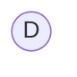
##### Padre nero
Se il padre del nodo da inserire è nero, posso aggiungere il nuovo nodo come rosso, e ho risolto.
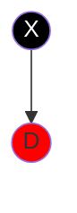
##### Padre rosso
Il nonno è sicuramente nero (non possono esistere due nodi rossi consecutivi).
Si aggiunge il nodo come rosso e si effettuano delle operazioni.
###### Caso 1: zio rosso
Il nonno diventa rosso
Il padre e lo zio diventano neri
Si richiama ricorsivamente la funzione `Fixup` sul nonno.
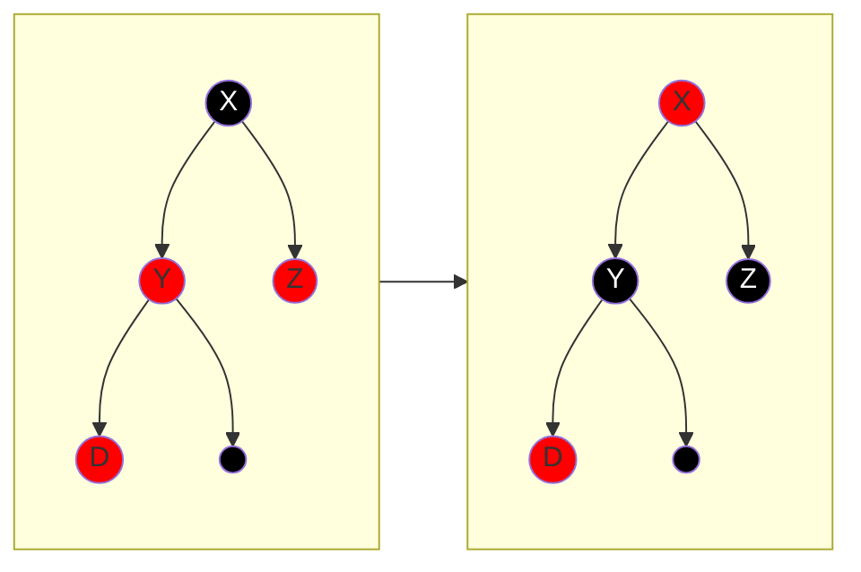
###### Caso 2: figlio esterno (sinistro), zio nero
Si effettua una rotazione destra sul padre.
Il (vecchio) nonno diventa rosso, il (vecchio) padre nero (si scambiano il colore)
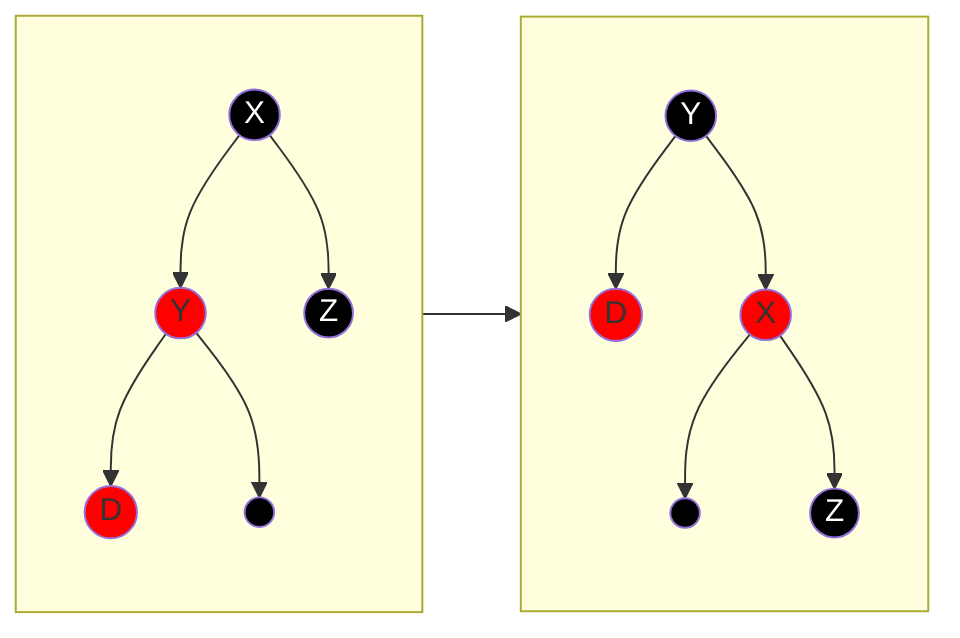
###### Caso 3: figlio interno (destro), zio nero
Si effettua la rotazione sinistra sul nodo e ci si ritrova nel caso 2.
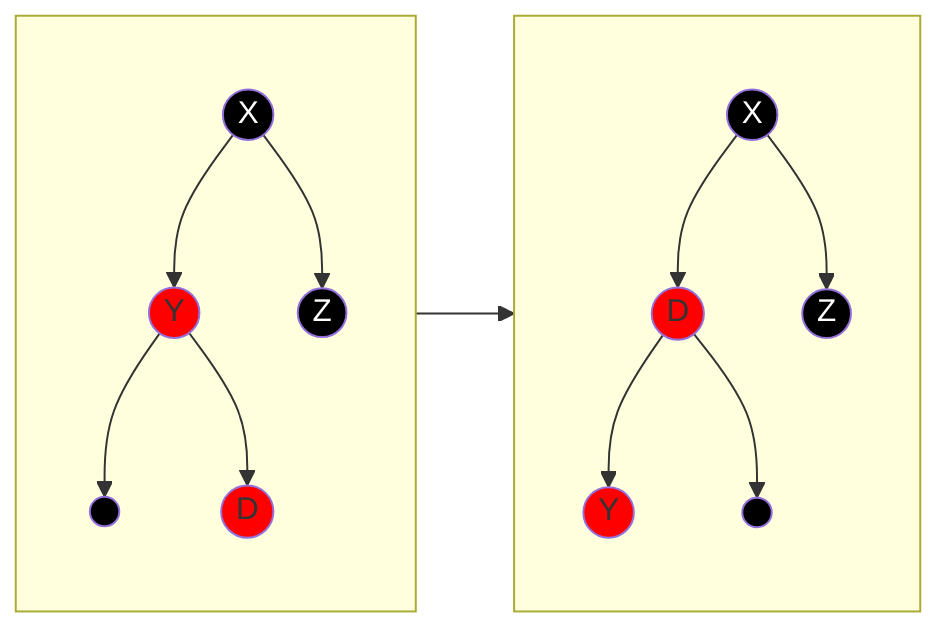

**I tre casi precedenti valgono in maniera speculare**.
### Cancellazione di un nodo

> [!abstract] BST
> **Caso 1: 0 figli**
> Il nodo da cancellare è una foglia. È sufficiente rimuovere l'arco e il nodo in questione.
> **Caso 2: 1 figlio**
> Il nodo da cancellare ha un solo figlio. È sufficiente collegare il padre con l'unico figlio.
> **Caso 3: 2 figli**
> Il nodo da cancellare ha due figli. Si procede scambiando il nodo con il suo successore ed eliminando il nodo del vecchio (ormai scambiato) nodo successore.

Assumiamo sempre che la rotazione implichi lo scambio dei colori tra il nodo da ruotare e il padre.
#### Nodo rosso
*Nel caso in cui un nodo abbia due figli, si procede come nel caso del BST, valutando quindi il nodo successore*
###### Caso 1: nodo rosso con 0 figli
È sufficiente rimuovere il nodo.
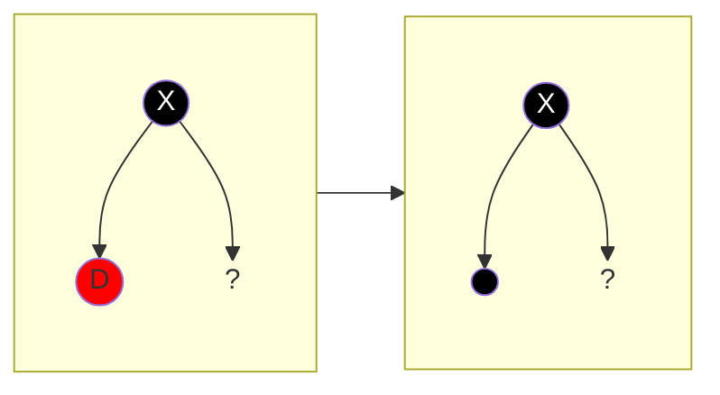
###### Caso 2: nodo rosso con 1 figlio
Il padre e il figlio sono due nodi neri.
È sufficiente rimuovere il nodo e collegare il padre al figlio del nodo.
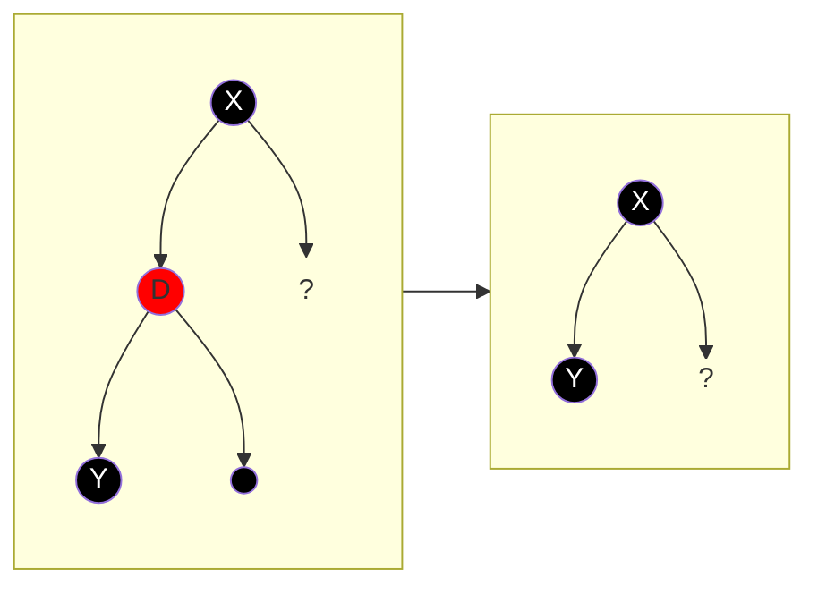
#### Nodo nero
###### Caso 1: nodo nero con 1 figlio nero
Si passa il nero al figlio. Il figlio è già nero quindi diventa momentaneamente un "doppio nero".
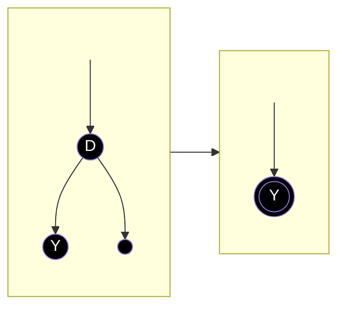
###### Caso 2: nodo nero con 1 figlio rosso
Si passa il nero al figlio e si elimina il nodo.
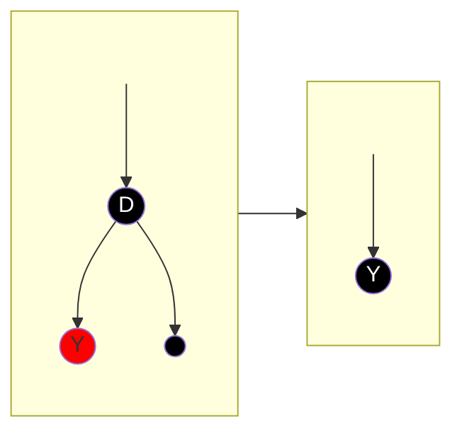
###### Caso 3: nodo nero con 0 figli
Il nodo viene eliminato e il padre fatto puntare a `null`. Il nodo eliminato passa il nero al `null`.
Il `null` del padre diventa momentaneamente un "doppio nero".
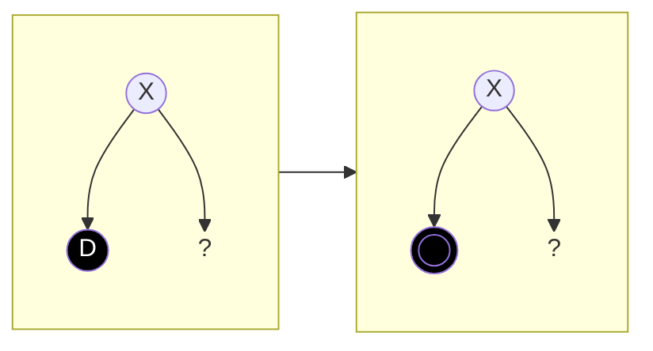
#### Fixup per eliminare i doppi neri
##### Caso 1: il fratello è nero con almeno un figlio rosso
###### Caso 1.1: il fratello è nero con figlio destro (esterno) rosso
Si effettua una rotazione sinistra sul fratello (ricordando di effettuare lo scambio di colore).
Il nodo doppio nero trasferisce il suo "doppio nero" al figlio destro del fratello (facendo riferimento alla configurazione pre-rotazione).
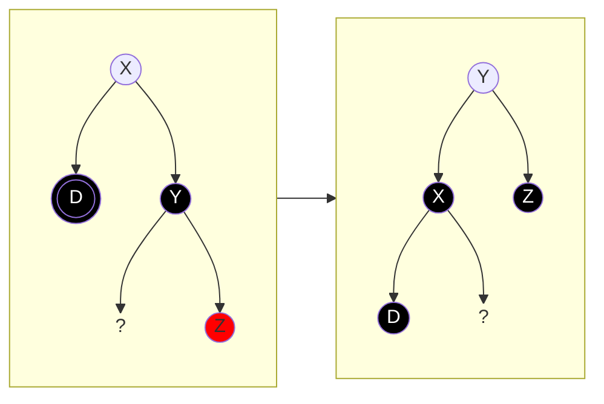
###### Caso 1.2: il fratello è nero e ha il figlio destro (esterno) nero e il figlio sinistro (interno) rosso
Si effettua una rotazione destra sul figlio sinistro del fratello. Ci ritroviamo nel caso [[2023-11-02 - RBT (delete)#Caso 1.1 il fratello è nero con figlio destro (esterno) rosso|1.1]].
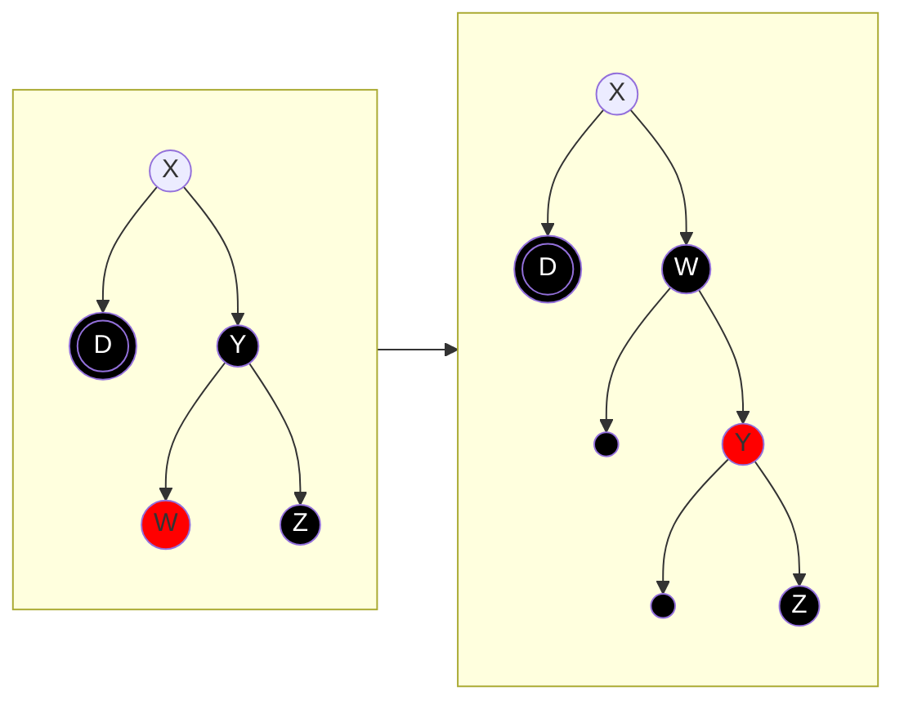
##### Caso 2: il fratello è nero con entrambi i figli neri
###### Caso 2.1: il padre è rosso
Il nodo doppio nero e il fratello trasferiscono il nero al padre.
Ovviamente il nodo doppio nero diventa nero dopo il trasferimento del colore, e il fratello rosso.
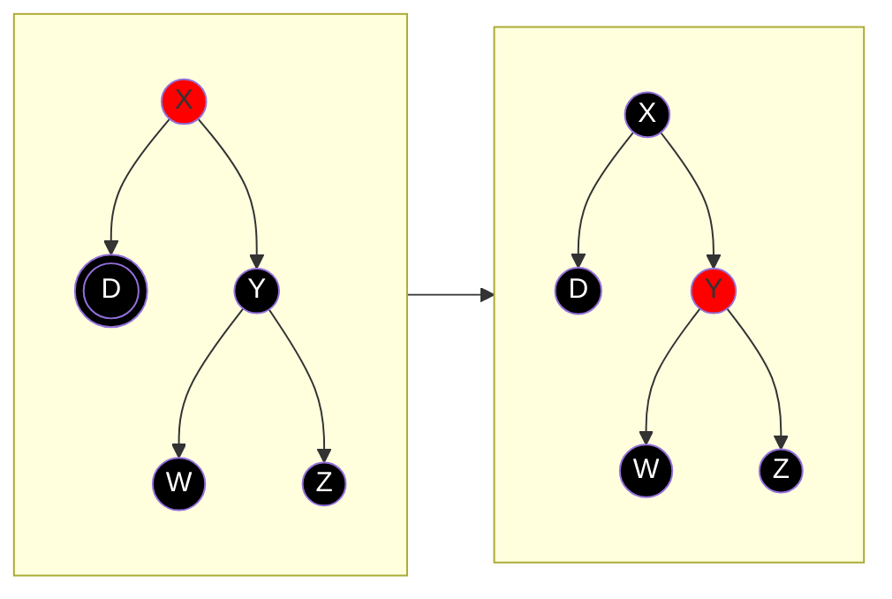
###### Caso 2.2: il padre è nero
Si procede come nel caso precedente, soltanto che a questo punto il padre diventa doppio nero.
Quindi si richiama ricorsivamente la procedura sul padre.
*Se il nodo dovesse giungere alla radice, il doppio nero può essere direttamente eliminato*
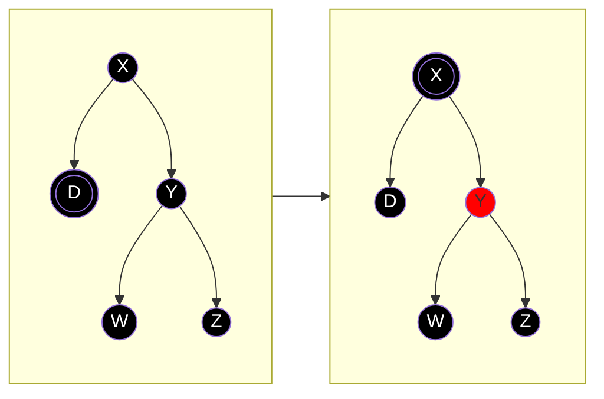
##### Caso 3: il fratello è rosso
Di conseguenza il fratello ha il padre e i figli neri.
Si effettua una rotazione sinistra sul fratello.
A questo punto il nodo doppio nero ha il fratello nero. Siamo quindi nel caso 1 o nel caso 2: si procede ricorsivamente.

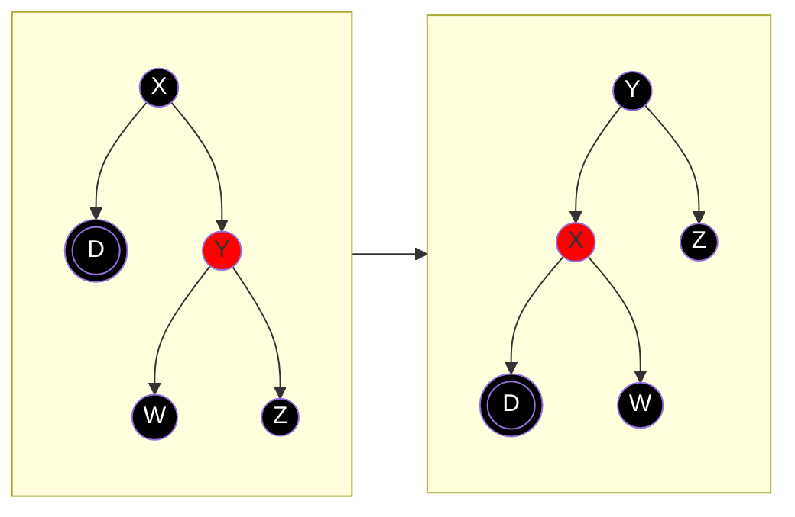

## Programmazione Dinamica
Utile per risolvere problemi di ottimizzazione.

Si usa la ricorsione pura quando i sottoproblemi vengono calcolati una volta sola.
Se i sottoproblemi vengono calcolati più di una volta, si può effettuare un'ottimizzazione.
- mediante memorizzazione: è utile se esistono sottoproblemi non esplorati per calcolare la soluzione
- mediante programmazione dinamica: se tutti i sottoproblemi sono necessari per risolvere il problema.

La programmazione dinamica trasforma l'approccio da Top-Down in Bottom-Up.
### Proprietà e passaggi per problemi ricorsivi
###### 1. Sotto-struttura ottima
Il problema è ricorsivo. Per risolvere il problema di ottimizzazione è necessario aver risolto i problemi di ottimizzazione dei sotto-problemi.
###### 2. Definizione ricorsiva ottima
Definire ricorsivamente una funzione ricorsiva per il calcolo del costo di una soluzione ottima
###### 3. Calcolo del costo di una soluzione ottima
Si definisce l'algoritmo vero e proprio in pseudo-codice basandosi sulla definizione ricorsiva dello step **2**, individuando se utilizzare:
- ricorsione pura
- ricorsione con memorizzazione
- dynamic programming
###### 4. Costruzione di una soluzione ottima

## Programmazione Greedy
### Algoritmo di Huffman
Serve per effettuare una compressione. Ridurre il numero di bit necessari per rappresentare un'informazione.
Si utilizza una lunghezza variabile di bit a seconda della frequenza del carattere da rappresentare (più il carattere è frequente, meno saranno i bit a rappresentarlo).

**Codice Prefisso**
La codifica di un carattere non deve mai essere il prefisso della codifica di un altro carattere.
Questo è necessario in quanto, se non rispettato, non si saprebbe come effettuare la decodifica (ci sarebbero delle ambiguità).

Si consideri $\Sigma$ l'alfabeto.
Indichiamo con $f(c)$ la frequenza del carattere $c \in \Sigma$ all'interno del testo.
Indichiamo con $l(c)$ il numero di bit necessari per rappresentare il carattere $c \in \Sigma$.

La formula $\sum\limits_{c \in \Sigma}{f(c) \cdot l(c)}$ indica il numero di bit necessari per rappresentare il testo di riferimento.
L'obiettivo è cercare di minimizzare questo valore, definendo opportunamente $l$ (rispettando sempre il codice prefisso).

La rappresentazione delle codifiche dei caratteri può essere definita da un albero binario (dove a sinistra il prossimo bit è $0$ e a destra $1$). Tutti i caratteri si troveranno nelle foglie (se non sono nelle foglie, la regola del codice prefisso non sarebbe rispettata).

Il livello ("l'altezza") di un nodo è detto **profondità**.
$$v(T)=\sum\limits_{c \in \Sigma}{f(c) \cdot d_{t}(c) } \quad\text {con } d_{t} \text{ la profondità del nodo } c $$
$v(T)$ è detta **valutazione** e va minimizzata.

#### Ricerca della valutazione ottimale
Ogni nodo ha due figli. Se ne avesse uno solo, allora il padre potrebbe essere sostituito con il figlio, riducendo di $1$ bit la rappresentazione dei caratteri del sotto-albero.

Per ogni carattere, si prendono i due caratteri più piccoli e si associano come figli di un nuovo nodo che ha come frequenza la somma dei figli (guarda libro pag. 359).
```
HUFFMAN(C, n):
	Q = BuildMinHeap(C)
	FOR i=1 TO n-1:
		z = new node()
		z.left = x = Q.ExtractMin()
		z.right = y = Q.ExtractMin()
		z.freq = x.freq + y.freq
		Q.Insert(z)
	RETURN Q.ExtractMin()
```

## Grafi

$G=(V, E)$
$V = \{ u_{0}, u_{1}, \dots, u_{n} \}$: nodi (insieme di elementi)
$E = \{ (u_{i}, u_{j}), (u_{h}, u_{k}), \dots \}$: archi (insieme di coppie di elementi di $V$)

Utilizzeremo $n$ e $m$ così definiti:
$n=|V|$
$m=|E|$

Si definisce la funzione **peso** $w: E \to \mathbb{R}$.
Associa a ogni arco un valore.

Si chiama cammino (path) una sequenza di nodi
$$< u_{0}, u_{1}, \dots, u_{n-1} >$$
con
	$u_{i} \in V \quad \forall\, 0 \leq i < n$
	$(u_{i}, u_{i+1}) \in E \quad \forall\, 0 \leq i < n-1$

Peso di un cammino:
$$\sum\limits_{i=0}^{n-1} w(u_{i}, u_{i+1})$$

Un cammino si dice **ciclo** se $u_{0} = u_{n}$

Una componente connessa è un insieme massimale di vertici che sono mutualmente raggiungibili (esiste un cammino che collega ogni nodo agli altri).

Se un cammino presenta due nodi uguali, allora questo presenta un ciclo al suo interno (e spesso si potrebbe saltare, a seconda dell'applicazione).

Se i cammini presentano un ciclo, questi possono essere infiniti.

Un cammino che non contiene cicli (e quindi nodi duplicati) si dice **semplice**.

*non sono sicuro:* La **BFS** per trovare cammini minimi non è adatta con grafi pesati. Ci potrebbero essere cammini meno costosi con un numero superiore di nodi rispetto ad altri.

La funzione
$$\delta(u_{i}, u_{j})$$
indica il peso del cammino minimo da $u_{i}$ a $u_{j}$.
$$\delta(u_{i}, u_{j}) = \min \{ w(u_{i}, u_{j}): u_{i} \stackrel{P}{\rightsquigarrow} u_{j}\}$$
> Se ci sono cicli con peso negativo, il problema non è risolvibile. Non esiste un cammino minimo (basterebbe aggiungere un'iterazione del ciclo per ottenere un cammino ancora meno costoso).

#### Problemi sui cammini minimi
###### Sorgente singola
$s\in V \to \delta(s, u_{i}) \quad \forall \,0 \leq i < n$
*consiste nel trovare tutti i cammini minimi dal nodo $s$ verso ogni nodo $u_{i}$*

###### Destinazione singola
$t\in V \to \delta(u_{i}, t) \quad \forall\, 0 \leq i < n$
Il problema della destinazione singola non viene studiato in quanto si possono invertire gli archi e sorgente e destinazione per ottenere un problema analogo a quello della sorgente singola.

###### Coppia di nodi
$s,t \in V \to \delta(s, t)$

###### Tutte le coppie di nodi
$u_{i}, u_{j} \in V \to \delta(u_{i}, u_{j}) \quad \forall\, 0 \leq i,j < n$
### DFS
Serve per effettuare una visita di un grafo.

Si prende la chiave più piccola e si visita in profondità a partire dal nodo che contiene la suddetta chiave.
I nodi non visitati sono bianchi, quelli per cui la visita è iniziata sono grigi e quelli per cui la visita è terminata sono neri.

Se ci sono nodi isolati (o comunque senza archi che li raggiungono) l'algoritmo continua, sempre a partire dalla chiave più piccola, finché non rimangono più nodi bianchi

Utilizziamo tre array ausiliari, che hanno una cella per ogni nodo del grafo.
$\forall\, v \in V$
	$d[v]=$ inizio visita ($\in \mathbb{N}$) "discovery"
	$f[v]=$ fine visita ($\in \mathbb{N}$) "finish"
	$\pi[v]=$ predecessore ($\in V$)

*Il contatore di inizio e fine visita è "condiviso" (l'intersezione è nulla)*

Ogni nodo per cui inizia la visita cambia colore in grigio, viene impostato il suo tempo di inizio visita e il suo predecessore.
A ogni nodo che finisce di essere visitato (che è quindi grigio) viene impostato il colore a nero e il suo tempo di fine visita.

Si crea una cosiddetta **foresta**. Un insieme di alberi dove ogni radice coincide con il nodo iniziale con cui si inizia la DFS.

Classifichiamo gli archi $E$ di un grafo $G$ in quattro tipi:
- Albero (A): sono tutti gli archi che fanno parte di un albero (della foresta) DFS
- Avanti (F - forward): sono tutti gli archi che uniscono i nodi di un albero DFS con tutti i suoi discendenti
- Indietro (I): l'opposto degli *archi in avanti* - sono tutti gli archi che uniscono i nodi di un albero DFS con tutti i suoi predecessori
- Attraversamento (C - cross): sono tutti gli archi che connettono due nodi che non sono successori/predecessori l'uno dell'altro, anche tra alberi diversi.

Gli archi albero sono tutti gli archi per i quali il nuovo nodo da visitare è bianco.
Gli archi all'indietro sono tutti gli archi per i quali il nuovo nodo da visitare è grigio. La presenza di un arco di questo tipo implica la presenta di un ciclo all'interno del grafo.
Se il nuovo nodo da visitare è nero, potrebbe trattarsi di un nodo in avanti o un nodo di attraversamento.

Indicheremo con `|--A--|` la rappresentazione del nodo `A` attraverso data inizio $d[A]$ e data fine $f[A]$.

Non può mai accadere che esistono tempo di inizio e fine di due nodi che non siano contenuti l'uno nell'altro, come ad esempio:
```
|---A---|
    |---B---|
```

Il nodo `A` è un predecessore diretto del nodo `B` (è presente quindi un nodo albero che unisce `A` e `B`)
```
|---A---|
 |--B--|
```

Nel seguente esempio, se esiste un arco che unisce i nodi `B` e `C`, allora è di attraversamento
```
|--------A-------|
 |-B-|  |--C--|
```

In questo caso invece, se esiste un arco che unisce i nodi `A` e `C`, allora è in avanti.
```
|--------A-------|
 |-----B-----|
     |--C--|
```

Quindi, si confronta il tempo di inizio visita del nodo nero da visitare con il tempo di inizio visita del nodo attuale. Se il primo è minore del secondo, si tratta di un nodo di attraversamento, viceversa si tratta di un nodo in avanti.
### Ordinamento Topologico
$$< u_{0}, u_{1}, \dots, u_{n-1} >$$
Ordina sulla base della topologia:
$$(u_{i}, u_{j}) \in E \implies i < j$$
> *tutti gli archi del grafo dai vertici ordinati devono andare da sinistra verso destra*

Possono esistere più ordinamenti topologici validi.

> [!question] Dato un grafo, qual è la situazione di un grafo in cui è presente il numero massimo di possibili combinazioni di un valido ordinamento topologico?
> Il grafo senza archi.

In presenza di cicli, non esiste un'ordinamento topologico.

È un ordinamento che si basa sulle dipendenze.
Si effettua una visita DFS.
Si ottengono $n$ alberi.
Se nel primo albero ci fosse stato un arco verso il secondo albero, sarebbe stato percorso, quindi non esistono archi che vanno dal primo al secondo albero.
L'ordinamento topologico quindi si può realizzare mettendo le visite DFS degli alberi dall'ultimo al primo (in modo tale da evitare eventuali archi che vanno dal secondo albero al primo, ad esempio)
Si prendono quindi i nodi per ordine di fine visita.

```
GLOBAL t

DFS(G)
	FOR EACH v IN G.V DO
		COLOR[v] = WHITE
		PI[v] = NULL
	t = 0
	FOR EACH v in G.V DO
		if (COLOR[v] == WHITE) THEN
			DFS-VISIT(v) 

DFS-VISIT(v)
	COLOR[v] = GRAY
	d[v] = t
	t = t + 1
	FOR EACH u IN Adj(v) DO // Adj ritorna i nodi adiacenti a v
		IF (COLOR[u] == WHITE) THEN
			PI[u] = v
			DFS-VISIT(u)
	COLOR[v] = BLACK
	f[v] = t
	t = t + 1
	
```

Se voglio controllare che un grafo sia aciclico è sufficiente aggiungere un controllo del colore grigio nella `DFS-VISIT`.

L'esecuzione è lineare, quindi la complessità è $O(V+E)$.

La **DFS** serve per
- ordinamento topologico
- rilevamento componenti connesse

La **BFS** serve per:
- calcolo cammino minimo
### Label Correcting
**Soluzione al problema** della [[2023-11-28 - grafi#**Sorgente singola**|sorgente singola]]
Algoritmo per ottenere il cammino con peso minimo a partire da un nodo $s$.

> [!note] Nota
> Non è un'implementazione vera e propria di un algoritmo. È solo un approccio alla risoluzione del problema dei cammini minimi da sorgente singola. Esistono poi diversi algoritmi che implementano la stessa logica (vedi ad esempio l'[[2023-12-12 - label correcting#Algoritmo di Bellman Ford|algoritmo di Bellman Ford]])

$d[v]=\text{ stima del peso di un cammino minimo} \quad \forall v \in V$

Inizialmente $d[v]=+\infty$, dopo l'iterazione (che *porta a convergenza*) dell'algoritmo $d[v] = \delta(s, v)$.
$$d[v]=+\infty \stackrel{\text{algoritmo}}{\rightsquigarrow} d[v]=\delta(s, v)$$

L'algoritmo si basa nel richiamare la funzione `relax(u, v, w)` che *rilassa* una coppia di nodi.
Per rilassamento si intende l'operazione così definita:
```cpp
if (d[v] > d[u] + w(u, v))
	d[v] = d[u] + w(u, v);
```

$\pi$ è un array che contiene nella posizione $v$ il predecessore di $v$. È utile per ricostruire il cammino.

SSSP: Single Source Shortest Path
Algoritmo generico *non ottimale*:
```python
NAIVE_SSSP(V, E, w, s):
	FOR v IN V:
		d[v] = +INF
		PI[v] = NULL
	d[s]=0
	WHILE ESISTE (u, v): d[u] > d[v] + w(u, v)
		GET (u,v) IN E
		RELAX(u, v, w)
```
Il `while` non si ferma mai se esistono cicli con peso negativo.

#### Proprietà del Label Correcting
##### Disuguaglianza triangolare

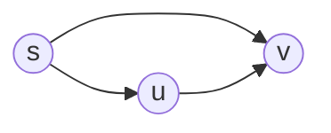
$$\delta(s, v) \leq \delta(s,u)+w(u,v)$$
##### Limite Superiore
$$ d[v] \geq \delta(s, v)$$

##### Assenza del cammino
Se non esiste un cammino $\delta(s, v) = d[v] = +\infty$.
##### Convergenza del cammino
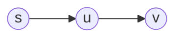
Sia $d[u] = \delta(s, u)$. Sia $u$ parte del cammino minimo.
Se si effettua una `RELAX(u, v, w)` su $v$ passando da $u$ allora $d[v] = \delta(s, v)$.
##### Rilassamento del cammino
Sia $p = < s, u_{0}, u_{1}, \dots, u_{k}, v >$ un cammino minimo.
Usando la [[2023-12-12 - label correcting#Convergenza del cammino|proprietà della convergenza]] si possono rilassare in sequenza i nodi $(s, u_{0}), (u_{0}, u_{1}), \dots, (u_{k}, v)$, ottenendo $d[v]=\delta(s, v)$.
#### Algoritmi
Per grafi con cicli con peso complessivo negativo il problema non ha soluzione e non è quindi risolvibile.
- Algoritmo di Bellman-Ford
	- Individua se il problema è risolvibile (ovvero se esistono cicli con peso negativo)
	- Risolve il problema su grafi senza limitazioni (ovvero riesce a gestire cicli e archi con peso negativo)
- Algoritmo di Dag-SP (Directed Acyclic Graph Shortest Path)
	- Risolve il problema in tempo lineare su grafi direzionali aciclici, anche con archi di peso negativo.
- Algoritmo di Dijkstra (si legge *dàistra*)
	- Risolve il problema su grafi con archi di peso positivo.

##### Algoritmo di Dag Shortest Path
Effettua l'ordinamento topologico e sulla base di quello vengono effettuati i rilassamenti.
Si iterano tutti i nodi seguendo l'ordinamento topologico e per ogni nodo vengono rilassati tutti gli archi che partono dal nodo in questione.
```
DAG-SHORTEST-PATH (G, w, s)
	FOR v IN G.V:
		d[v] = +INF
		PI[v] = NULL
	d[s] = 0
	
	V = TOPOLOGICAL_SORT(G)
	FOR v in V:
		FOR u in Adj(v):
			RELAX(v, u, w)
```
La complessità è lineare $O(|V| + |E|)$.
##### Algoritmo di Bellman Ford
Nel peggiore dei casi, il cammino minimo comprende tutti i nodi del grafico.
Bastano $|V|-1$ iterazioni di relax di tutti gli archi per poter ottenere tutti i cammini minimi. $N\leq|V|-1$
```
BELLMAN-FORD (G, w, s):
	FOR v IN G.V:
		d[v] = +INF
		PI[v] = NULL
	d[s] = 0
	FOR 1 TO |G.V|-1:
		FOR (u, v) IN G.E:
			RELAX(u, v, w)
	
	// si individuano eventuali cicli a peso negativo
	FOR (u, v) IN G.E:
		// esistono archi ancora rilassabili, è solo possibile in grafi con cicli con peso negativo
		IF d[v] > d[u] + w(u, v):
			RETURN FALSE;
	RETURN TRUE;
```
La complessità è quadratica $O(|V| \cdot |E|)$.
##### Algoritmo di Dijkstra
L'insieme $V$ è diviso in due sottoinsiemi: ${} S$ e $V-S$:
- $S$ contiene i nodi che sono portati a convergenza.
- In $V-S$ sono presenti sia i nodi non portati a convergenza ($d[v] > \delta(s, v)$), sia quelli portati a convergenza ancora da individuare ($d[v] = \delta(s, v)$)

L'algoritmo si basa sul'assunzione che, in seguito a tutti i rilassamenti a partire da un nodo portato a convergenza, in $V-S$ sia presente almeno un elemento portato a convergenza, e quest'ultimo coincide con il nodo per cui $d[v]$ è minimo in $V-S$.
Se esistessero archi con peso negativo questa assunzione sarebbe sbagliata.

Avendo la necessità di prendere il nodo con $d[v]$ minimo, si presta bene l'implementazione di $d$ con una coda con priorità [[2023-10-10 - heap|Min-Heap]].

*nel codice l'insieme $S$ non esiste, perché non serve salvare gli elementi. Vengono utilizzati soltanto quando vengono spostati e nel codice coincidono con la variabile `u`*
```
DIJKSTRA (G, w, s):
	FOR v IN G.V:                 O(V)
		d[v] = +INF
		PI[v] = NULL
	d[s] = 0
	Q = BuildMinHeap(G.V)         O(V)
	FOR i=1 TO |G.V|:             O(V)
		u = extractMin(Q)         O(log V)
		FOR v IN G.Adj(u):        O(E)
			RELAX(u, v, w)        O(log V)
```
La complessità è $O(|E|\log |V|+|V|\log |V|)=O((|V|+|E|)\log |V|)$.
#### Complessità Algoritmi
| Algoritmo    | Liste        | Matrici      |
| ------------ | ------------ | ------------ |
| Dijkstra     | O((V+E) * logV) | O(V^2 * log V) | 
| Bellman-Ford | O(VE)        | O(V^3)       |
| Dag-SP       | O(V+E)       | O(V^2)       |

### APSP
**All Pairs Shortest Path**
Indica il problema del calcolo del cammino minimo tra tutte le coppie di nodi.

$$\forall\, u, v \in V \text{ dobbiamo calcolare } \delta(u, v)$$

In SSSP utilizzavamo $d[v]$ per contenere il cammino minimo attuale dal nodo $s$ al nodo $v$. Qui è necessario cambiare la sorgente, quindi si utilizza una matrice $D$ bidimensionale.
$D[i, j]$ indica il cammino minimo attuale da $i$ a $j$.
*Invece di $u$ e $v$ si utilizzano, per convenzione, $i$ e $j$.*

L'obiettivo è ottenere $D[i, j] = \delta(i, j) \quad \forall\, i, j \in V$.

Per questo tipo di problemi conviene sempre utilizzare la matrice di adiacenza per rappresentare il grafo. Il vantaggio di efficienza delle liste viene perso dovendo utilizzare $D$.

> [!info] Rappresentazione di un grafo direzionale tramite matrice
> Si ricorda che per rappresentare un grafo non pesato direzionale, si utilizza una matrice dove in ogni cella è presente $1$ se è presente un arco che va da $i$ a $j$ (rispettivamente da numero di riga $i$ verso numero di colonna $j$), altrimenti $0$.
> 
> Per i grafi pesati al posto di $1$ si mette il peso dell'arco, e al posto di $0$ si mette $+\infty$ (come se l'arco esistesse ma con un peso infinito). Nella diagonale principale sarà presente il peso dell'arco che va da un nodo verso se stesso. Sarà quindi presente $0$ in tutte le celle della diagonale principale ($i=j$)

La matrice $D$ conterrà $0$ in tutte le celle della diagonale principale. Ogni nodo per raggiungere se stesso ha un $\delta=0$. Quindi $\delta(i,i)=0 \quad \forall\, i \in V$
> Nota: Se il grafo dovesse contenere cicli con peso negativo quanto descritto precedentemente non varrebbe più, e il problema non sarebbe risolvibile.

#### Algoritmo con SSSP
Avendo già visto come risolvere il problema di SSSP. sarebbe sufficiente effettuare $|V|$ iterazioni di algoritmi SSSP e si risolverebbe il problema.
La complessità sarebbe quindi quella dell'algoritmo SSSP utilizzato, moltiplicata per $|V|$. Quindi:
- `BF`: $O(|V|^{4})$
- `DAG`: $O(|V|^{3})$
- `DIJ`: $O(|V|^{3} \cdot \log |V|)$

Non è il modo più efficiente di risolvere il problema.
> Il problema di SSSP gode della proprietà della sottostruttura ottima e quindi utilizzando sotto problemi ottimali arriva a risolvere il problema principale. Vengono quindi calcolati tutti i sottocammini minimi da ogni nodo del cammino minimo principale verso il nodo finale.
> 
> Ad esempio, calcolare $\delta(u, v)$ con SSSP, consente anche di trovare $\delta(v_{1}, v)$, $\delta(v_{2}, v)$ e $\delta(v_{3}, v)$.
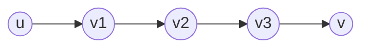

#### Matrix Multiplication
**Si sfrutta la programmazione dinamica.**

Indichiamo con $m$ la lunghezza massima di un cammino minimo.
Indichiamo con $\delta^{m}(i, j)$ il cammino minimo da $i$ a $j$ di lunghezza al massimo $m$.
In tutti i grafi vale
$$\delta(i, j) = \delta^{|V|-1}(i, j) \quad \forall\, i,j \in V$$
in quanto in un cammino minimo non può essere più lungo di $|V|-1$ archi (stesso ragionamento utilizzato in [[2023-12-12 - label correcting#Algoritmo di Bellman Ford|Bellman Ford]]). Se si ottiene un cammino minimo inferiore anche un numero di archi superiore, vuol dire che sono presenti cicli con peso negativo.

$$D^{1}=w\to D^{2}\to \dots \to D^{V-1}$$
dove $w$ è la matrice che rappresenta i pesi del grafo (e quindi il grafo vero e proprio).

**Caso Base**:
- si potrebbe prendere $m=0$. In questo caso $D[i,j]=0 \iff i=j$, altrimenti $d[i,j]=+\infty$.
- si prende invece $m=1$ considerando che coincide con la matrice del grafo iniziale.
**Passo Induttivo**: si ottiene $D^{m}$ a partire da $D^{m-1}$. Quindi $D^{m-1} \to D^m$.

Per passare da $\delta^{m-1}(i,j)$ a $\delta^{m}(i,j)$ è sufficiente aggiungere un arco. Il ragionamento è analogo a quello fatto per la `RELAX`:
$$
\begin{align}
D^{m}[i,j] &=\min\left(D^{m-1}[i,j], \min\limits_{0 \leq k < n}(D^{m-1}[i,k] + w[k,j])\right) \tag{D.1}\\&=\min\limits_{0 \leq k < n}(D^{m-1}[i,k] + w[k,j]) \tag{D.2}
\end{align}
$$
Nel calcolo del minimo più interno della formula ${} (\text{D.1}) {}$, si può evitare di controllare il caso in cui $k=i \lor k=j$. Coinciderebbe con il dover calcolare $D^{m-1}[i,j]$ (che è calcolato esternamente).

```
n = |V|

EXTEND-SHORTEST-PATH(Dn_1, w):
	Dn = MATRIX(n x n)
	FOR i=1 TO n DO:
		FOR j=1 TO n DO:
			Dn[i,j] = +INF
			FOR k=1 TO n DO:
				Dn[i,j] = min(Dn[i,j], Dn_1[i,k]+w(k, j))
	RETURN Dn;

APSP(w, n):
	D1 = w
	FOR m=2 TO n-1:
		Dm = EXTEND-SHORTEST-PATH(Dm_1, w)
	// si potrebbe controllare che non siano presenti cicli con peso negativo come fatto con BF.
	RETURN D
```
La complessità è $O(|V|^{4})$, uguale a quella ottenuta dall'iterazione dell'algoritmo di BF.

L'algoritmo sopra citato viene chiamato anche come metodo della moltiplicazione di matrici.
```
MATRIX-MULTIPLY(A, B):
	C = MATRIX(n x n)
	FOR i=1 TO n DO:
		FOR j=1 TO n DO:
			C[i,j]=0
			FOR k=1 TO n DO:
				C[i, j] += A[i,k] + B[k, j]
```
Questo algoritmo che effettua la moltiplicazione tra due matrici è molto simile a quello di `EXTEND-SHORTEST-PATH`.
$$D^{m-1} \times w \to D^{m}$$
Con l'algoritmo calcoleremo $D$ come segue:
$$
\begin{align}
D^{1}&=w \\ D^{2}&=D^{1} \times w \\ D^{3}&=D^{2} \times w \\ \dots
\end{align}
$$
Di fatto è come scrivere $D^{m-1} \times D^1 \to D^{m}$. Vale quindi la proprietà della somma degli esponenti (come avviene per il prodotto di potenze).
#### Fast-APSP
Per calcolare $D^{n}$ è sufficiente calcolare $D^\frac{n}{2}$ e moltiplicare la matrice per se stessa. $D^{\frac{n}{2}} \times D^{\frac{n}{2}} \to D^{n}$.
L'algoritmo a questo punto diventa logaritmico $O(|V|^{3} \cdot \log |V|)$.
```
FAST-APSP(w)
	D1 = w
	m = 1
	WHILE (m < n-1) DO
		D^2m = EXTEND-SHORTEST-PATH(D^m, D^m)
		m = 2m
	RETURN D^m
```
Se $|V|=11$ per calcolare $D^{11}$ arriverei (moltiplicando per due) a $D^{16}$ ($D^{1} \to D^{2} \to D^{4} \to D^{8} \to D^{16}$).
Se non esistono cicli di peso negativo, $D^{11} = D^{16}$.

> [!question] Possibile domanda
> Scrivere la definizione ricorsiva del calcolo di una soluzione ottima dell'algoritmo `FAST-APSP`.
> $D^{m} \times D^{m} = D^{2m}$.


> [!question] Possibile domanda
> Scrivere la definizione ricorsiva del calcolo di una soluzione ottima dell'algoritmo `APSP`.
> $D^{m-1} \times w = D^{m}$.


#### Algoritmo di Floyd-Warshall
A differenza del metodo della moltiplicazione delle matrici, la dimensione non è più data dalla lunghezza del cammino, bensì dai **nodi intermedi che possono essere coinvolti in un cammino minimo**.
Per nodo intermedio si intende, dato un cammino, l'insieme dei nodi che non comprendono nodo iniziale e nodo finale.
Tale numero lo chiamiamo $n$.

Sia $V$ l'insieme dei nodi del grafo.
Indicheremo con ${} V_{m} {}$ il sottoinsieme di $V$ che contiene i primi $m$ nodi di $V$. Vale quindi $V_{m} \subseteq V \land |V_{m}|=m$ 
${} V_{m}$ è definito per valori di $m$ da $0$ (insieme vuoto) a $n$ (quindi $V_{n}=V$).

Siano $s$ e $t$ rispettivamente i nodi di inizio e fine del cammino.
Valutando $V_{0}$, deve esistere un cammino diretto che collega $s$ e $t$.
Valutando $V_{1}$, deve esistere un cammino diretto che collega $s$ e $t$, oppure un nodo intermedio (il primo) che collega $s$ e $t$.
Valutando ${} V_{2} {}$, deve esistere un cammino diretto che collega $s$ e $t$, oppure due nodi intermedi (i primi due) che collegano $s$ e $t$.
...

**Caso Base**: $V_{0}$.

**Passo Induttivo**
Si ottiene $V_{m}$ a partire da  $V_{m-1}$.
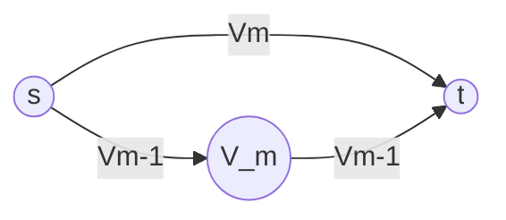
$$
D^{m}[i,j]= \min(D^{m-1}[i,j], D^{m-1}[i,m]+D^{m-1}[m,j])
$$

Sia $w=D^{0}$ ($D$ ha la stessa definizione della lezione precedente).
```
FLOYD-WARSHALL(w, n):
	D0 = w
	FOR m=1 TO n DO:
		Dm = new matrix[n x n]
		FOR i=1 TO n DO:
			FOR j=1 TO n DO:
				Dm[i, j] = Dm_1[i, j]
				IF Dm_1[i, m] + Dm_1[m, j] < Dm[i, j]
					Dm[i, j] = Dm_1[i, m] + Dm_1[m, j]
```
La complessità è $O(|V|^{3})$.

In Bellman-Ford era possibile individuare eventuali cicli con peso negativo e restituire errore. Era sufficiente aggiungere un'ulteriore iterazione nel codice.
In Floyd-Warshall questo non è possibile. Bisogna assicurarsi che il grafo passato in input non contenga cicli con peso negativo.

L'implementazione precedente non salva in `PI` la cronologia dei nodi percorsi. Bisogna quindi modificare l'algoritmo.
$$
\pi^{0}[i, j] = \begin{cases}
i &\text{se } i \neq j \,\land\, (i, j) \in E \\
\text{null} &\text{se } i = j \,\lor\, (i, j) \not\in E
\end{cases}
$$

```
FLOYD-WARSHALL(w, n):
	D0 = w
	FOR m=1 TO n DO:
		PIm = new matrix[n x n]
		Dm = new matrix[n x n]
		FOR i=1 TO n DO:
			FOR j=1 TO n DO:
				Dm[i, j] = Dm_1[i, j]
				PIm[i, j] = PIm_1[i, j]
				IF Dm_1[i, m] + Dm_1[m, j] < Dm[i, j]
					Dm[i, j] = Dm_1[i, m] + Dm_1[m, j]
					PIm[i, j] = PIm_1[m, j]
```

La seguente implementazione prevede l'utilizzo di un'unica matrice per `D` e `PI:
```
FLOYD-WARSHALL(w, n):
	D = w, PI = { ... (sistema di sopra)
	FOR m=1 TO n DO:
		FOR i=1 TO n DO:
			FOR j=1 TO n DO:
				IF D[i, m] + D[m, j] < D[i, j]
					D[i, j] = D[i, m] + D[m, j]
					PI[i, j]=PI[m, j]
```

*vedi esempio nel libro*


*facendo gli esercizi "a mano", se $D[i,m]$ o $D[m, j]$ contiene più infinito, l'intera riga o colonna può essere ricopiata direttamente*
