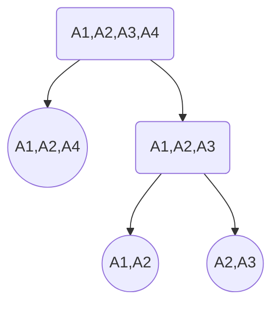

Gentilmente offerto da [Kevin Speranza](https://github.com/Kespers)

---
#attensionplis 
1. se lo schema è in BCNF allora è anche 3NF
2. dipendenza banale: $X \to X$
# Boyce Codd (BCNF)
Uno schema relazionale è in **BCNF** se per ogni dipendenza non banale di $F^+$, saranno del tipo $X\to A$
- X superchiave (è una chiave o la contiene)

$$
R = \{C,S,Z\}
$$
$$
F = \{CS\to Z, Z\to C\}
$$
le chiavi sono CS e ZS

non è in BCNF in quanto Z non è una superchiave

## Algortimo
#attensionplis uno schema formato da 2 attributi è in BCNF

Dato uno schema R e dipendenze funzionali F, l'algortimo restituisce una decomposizione in BCNF che preserva i dati
- se faccio una proiezione di F sulle decomposizioni ottengo tutte le dipendenze del tipo $X\to A$ con $X$ superchiave

#ex
Siano
$$
F = \{A_{1},A_{2}\to A_{4}\}
$$
$$
R = \{A_{1},A_{2},A_{3},A_{4}\}
$$
trasformare lo schema in BCNF

1. dividere lo schema in 2, dove la prima componente è formata da XA ($X \to A$) e la seconda formata da $R - A$

2. la prima componente è in bcnf, continuare ricorsivamente sulla seconda
- nel caso non si riconducono a dipendenze funzionali, dividere in coppie (assioma)

# Terza forma normale (3NF)
Uno schema relazionale è in **3NF** se per ogni dipendenza $X\to A$ non banale
-  $X$ è una superchiave
oppure
-  $A$ è primo (appartiene a qualche chiave)

$$
R = \{C,S,Z\}
$$
$$
F = \{CS\to Z, Z\to C\}
$$

CS e ZS chiavi

è in 3FN in quanto CS è una superchiave e Z è primo

## Algoritmo

$$
F = \begin{cases}
A_{1},A_{2}\to A_{4} \\
A_{1}\to A_{3}
\end{cases}
$$
$$
R = \{A_{1},A_{2},A_{3},A_{4},A_{5},A_{6}\}
$$

trasformare in 3NF

1. creo una tabella formata dagli attributi non presenti in F
$$
R_{1}=\{A_{5},A_{6}\}
$$
2. per ogni dipendenza di F creo una tabella apposita
$$
R_{2}=\{A_{1},A_{2},A_{4}\} \quad R_{3} = \{A_{1},A_{3}\}
$$

#attensionplis 
nel caso in cui F sia del tipo
$$
F = \begin{cases}
A_{1},A_{2}\to A_{4} \\
A_{1}\to A_{3} \\
A_{1} \to A_{7}
\end{cases}
$$

al posto di creare un ulteriore tabella, unisco l'attributo alla tabella già esistente
$$
\cancel{ R_{4}=\{A_{1},A_{7}\} } \implies R_{3}={A_{1},A_{3},A_{7}}
$$

